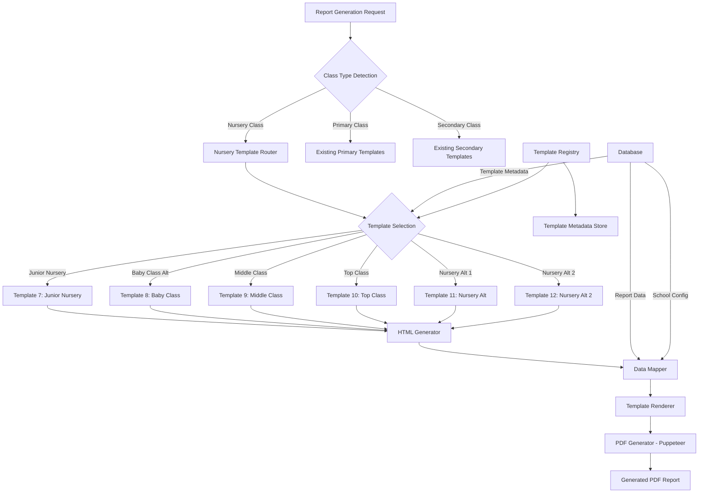
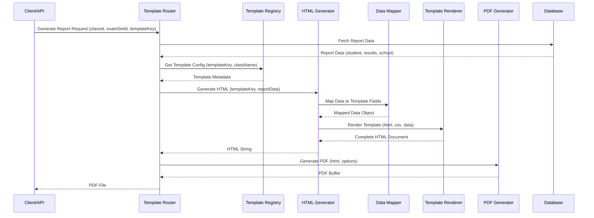

# Design Document: Nursery Report Card Templates System

## Overview

This design document specifies the implementation of 6 new nursery report card templates for Cindrelinah Junior School. The system will support Baby Class, Middle Class, and Top Class with multiple template variations. Each template must generate pixel-perfect PDF output matching the original designs, fit on a single A4 page, and integrate seamlessly with the existing report generation infrastructure.

The templates will be implemented as HTML/CSS with server-side PDF generation via Puppeteer, following the established pattern used by existing templates (template1-template6). The design preserves all existing functionality while adding new template options specifically for nursery classes.

## Architecture



## Main Algorithm/Workflow



## Components and Interfaces

### Component 1: Template Registry

**Purpose**: Manages template metadata, configuration, and selection logic for all nursery templates.

**Interface**:
```typescript
interface NurseryTemplateRegistry {
  registerTemplate(config: TemplateConfig): void
  getTemplate(key: string): TemplateConfig | null
  getTemplateForClass(className: string): TemplateConfig
  listTemplates(filter?: TemplateFilter): TemplateConfig[]
}

interface TemplateConfig {
  key: string                    // e.g., 'template7', 'template8'
  id: string                     // e.g., 'nursery_junior_template'
  name: string                   // Display name
  description: string            // Template description
  section: NurserySection        // 'Baby Class' | 'Middle Class' | 'Top Class'
  schoolType: 'Nursery/Primary'
  subjects: string[]             // Supported subjects/learning areas
  colorTheme: ColorTheme         // Primary colors for the template
  layoutType: LayoutType         // 'table' | 'grid' | 'card'
  pdfOptions: PdfGenerationOptions
}

interface ColorTheme {
  primary: string                // Main theme color (hex)
  secondary?: string             // Secondary color
  accent?: string                // Accent color
  text: string                   // Text color
  border: string                 // Border color
}

interface PdfGenerationOptions {
  format: 'A4'
  margin: {
    top: string
    right: string
    bottom: string
    left: string
  }
  printBackground: boolean
  preferCSSPageSize: boolean
}

type NurserySection = 'Baby Class' | 'Middle Class' | 'Top Class'
type LayoutType = 'table' | 'grid' | 'card'
```

---

## Template Specifications

### Template 7: Junior Nursery Report Template

**Visual Reference**: `Junior Nursery-Report-Template.pdf`

**Template Name**: "Junior Nursery Report Template"

**Target Classes**: TOP Class, Middle Class, Baby Class

**Key Visual Characteristics**:
- **Border**: Thick double border in Forest Green (#006b4d) - 4px double
- **Color Scheme**: Forest Green (#006b4d) for all borders, headers, and accents
- **Layout**: Simple, clean table-based layout
- **Typography**: 
  - Headers: Bold sans-serif (Arial/Segoe UI)
  - Data fields: Monospace (Courier New) for filled-in values
  - School name: Large, uppercase, centered

**Layout Structure**:

1. **Header Section** (Centered):
   - School name: "CINDRELINAH JUNIOR SCHOOL" (large, bold, uppercase)
   - Address: "Location Gangu Kimwanyi Busaabala Road"
   - Contact: "Tel: 0751 230190 / 0772 604623 / 0702 086390"
   - Report title: "NURSERY REPORT FORM" (underlined, letter-spaced)

2. **Student Information Section** (Dotted underlines):
   - Layout: Flexible grid
   - Fields:
     - Pupil's name: (60-70% width)
     - Class: (right side)
     - Age: | Term: | Year: (inline, same row)
     - Position: ............... Out Of: ...................

3. **Assessment Table**:
   - **Columns**:
     - SUBJECT (30%, left-aligned)
     - EXAM MARKS OBTAINED OUT OF 100 (15%, centered)
     - EXAM AGG (10%, centered)
     - AGG. GRADE (10%, centered)
     - REMARKS (25%, left-aligned)
     - INITIALS (10%, centered)
   
   - **Subjects** (as shown in template):
     - LEARNING AREA 1
     - LEARNING AREA 2
     - LEARNING AREA 3
     - LEARNING AREA 4
     - LEARNING AREA 5
     - GEN. KNOWLEDGE
     - TOTAL (bold row)
   
   - **Cell Styling**:
     - All cells: thin solid green border
     - Header row: slight background tint
     - Total row: bold text

4. **Comments Section**:
   - **Class Teacher's Report**:
     - Label + text area with dotted bottom border
     - Signature line (dotted)
   
   - **Headteacher's Report**:
     - Label + text area with dotted bottom border
     - **Special**: Text in RED color
     - Signature line (dotted)

5. **Requirements Section**:
   - Small text (8-9pt)
   - List of required items

6. **Footer**:
   - Flexbox layout (space-between)
   - "End of term: [DATE]" (left)
   - "Next term begins on: [DATE]" (right)

**PDF Configuration**:
```typescript
{
  format: 'A4',
  margin: {
    top: '10mm',
    right: '10mm',
    bottom: '10mm',
    left: '10mm'
  },
  printBackground: true,
  preferCSSPageSize: true
}
```

**Data Mapping**:
```typescript
interface Template7Data {
  school: {
    name: string
    address: string
    phone: string
  }
  student: {
    name: string
    class: string
    age: string
    term: string
    year: string
    position?: string
    outOf?: string
  }
  subjects: Array<{
    name: string
    marksObtained: number
    outOf: number
    examAgg: number
    aggGrade: string
    remarks: string
    initials?: string
  }>
  total: number
  comments: {
    classTeacher: {
      text: string
      signature?: string
    }
    headteacher: {
      text: string
      signature?: string
    }
  }
  requirements: string
  termDates: {
    endDate: string
    nextTermBegins: string
  }
}
```

---

### Template 8: Detail Colour Marks Report Template

**Visual Reference**: `Detail colour marks-Report-Template.pdf`

**Template Name**: "Detail Colour Marks Report Template"

**Target Classes**: BABY Class, Middle Class, Top Class

**Key Visual Characteristics**:
- **Border**: Simple single border (black, 2px solid)
- **Color Scheme**: Multi-color for skill assessment boxes
- **Layout**: Complex - combines skills grid + academic table + requirements
- **Typography**: 
  - Headers: Bold sans-serif
  - Skills grid: Small font (8pt) for density
  - Data: Standard sans-serif

**Layout Structure**:

1. **Header Section** (Centered):
   - Logo placeholder (left, circular)
   - School name: "RAKAI INFANT AND PRIMARY SCHOOL" (large, bold)
   - Address: "P. O. BOX 7, RAKAI: TEL NO. 0783124136/0706779395"
   - Report title: "TERMINAL PROGRESSIVE REPORT FOR NURSERY" (underlined)

2. **Student Information Section**:
   - Pupil's Name: (blue text for value)
   - Class: | Year: | Term: | Age: (inline)
   - Date: | LIN NO: (inline)

3. **Skills Assessment Grid** (3 rows × 8 columns = 24 skills):
   - **Table layout**: `table-layout: fixed` for equal column widths
   - **Font size**: 8pt (very dense)
   - **Skills** (preserve exact order):
     
     **Row 1**:
     - Toilet
     - Recognition of numbers
     - Property care
     - Handling of pencil
     - Re-sighting Alphabet
     - Attention span
     - Punctuality
     - Shading
     
     **Row 2**:
     - Nose care
     - Recognition of shapes
     - Respect
     - Arrival time
     - Counting number sequence
     - Re-sighting Poems
     - Love or Interest
     - Drawing
     
     **Row 3**:
     - Recognition of letters
     - Sharing
     - Friendship
     - Colours
     - Playing
     - Emotional
     - Smartness
     - (empty cell)
   
   - **Assessment Method**: Color-coded boxes filled in for each skill

4. **Legend/Key Section**:
   - Flexbox container with empty boxes
   - Labels: "Very Good:", "Good:", "Tries:", "Fair:", "Still a Problem:", "Promising:"
   - Empty boxes (1px solid black border, fixed width/height)

5. **Academic Assessment Table**:
   - **Columns**:
     - Subject (left-aligned)
     - Mid Term (centered)
     - End of Term (centered)
     - Out of (centered)
     - Teacher's Remarks (left-aligned, **rowspan**)
     - Signature (**rowspan**)
   
   - **Subjects** (as shown in template):
     - Social Development 1
     - Language Development 1
     - Health Habits
     - Mathematical Concept
     - Language Development II
     - Writing
     - TOTAL (bold row, outside rowspan)
   
   - **Rowspan Logic**: 
     - "Teacher's Remarks" and "Signature" columns span rows 1-6
     - TOTAL row is separate

6. **Comments Section**:
   - Class Teacher's Comment: (blue text for value) + Signature line
   - Headteacher's Comment: (regular text) + Signature line
   - Next term dates: "Next term begins on:" | "Ends on:"

7. **Requirements Section** (Two-column grid):
   - **Left Column**: "BOARDING REQUIREMENTS"
     - Bulleted list with specific items
   - **Right Column**: "DAY REQUIREMENTS"
     - Bulleted list with fees and items
   
   - **Grid**: `display: grid; grid-template-columns: 1fr 1fr; gap: 20px;`
   - **Font size**: 8.5-9pt to fit all content
   - **Lists**: `<ul>` with `padding-left`

**PDF Configuration**:
```typescript
{
  format: 'A4',
  margin: {
    top: '8mm',
    right: '8mm',
    bottom: '8mm',
    left: '8mm'
  },
  printBackground: true,
  preferCSSPageSize: true
}
```

**Data Mapping**:
```typescript
interface Template8Data {
  school: {
    name: string
    address: string
    phone: string
    logo?: string // base64 or URL
  }
  student: {
    name: string
    class: string
    year: string
    term: string
    age: string
    date: string
    linNo?: string
  }
  skillsAssessment: Array<{
    skill: string
    status: 'Very Good' | 'Good' | 'Tries' | 'Fair' | 'Still a Problem' | 'Promising' | null
  }>
  subjects: Array<{
    name: string
    midTerm: string // Grade letter
    endOfTerm?: string
    outOf: number
    teacherRemarks?: string
    signature?: string
  }>
  total: number
  comments: {
    classTeacher: {
      text: string
      signature?: string
    }
    headteacher: {
      text: string
      signature?: string
    }
  }
  termDates: {
    nextTermBegins: string
    endsOn: string
  }
  requirements: {
    boarding: string[]
    day: string[]
  }
}
```

---

## Component 2: HTML Generator Functions

**Purpose**: Generate HTML strings for each template using reportData

**Interface**:
```typescript
function generateTemplate7HTML(
  reportData: Template7Data,
  schoolLogoBase64?: string | null
): string

function generateTemplate8HTML(
  reportData: Template8Data,
  schoolLogoBase64?: string | null
): string

function generateTemplate9HTML(
  reportData: Template9Data,
  schoolLogoBase64?: string | null,
  studentPhotoBase64?: string | null
): string
```

---

### Template 9: Academy Professional Report

**Visual Reference**: `Academy-Professional-Report.pdf`

**Template Name**: "Academy Professional Report"

**Target Classes**: TOP CLASS, Middle Class, Baby Class

**Key Visual Characteristics**:
- **Color Scheme**: Deep Navy Blue (#002366) for all text and borders (not black)
- **Border**: Clean single border with professional styling
- **Layout**: Modern, grid-based with student photo
- **Typography**: 
  - Headers: Professional sans-serif (Inter/Arial) or serif (Times New Roman)
  - School name: Large, bold, uppercase, navy blue
  - Comments: Italicized text for distinction
- **Watermark**: Subtle school name watermark (opacity: 0.05) for security

**Layout Structure**:

1. **Header Section** (Centered):
   - School name: "SANTINA ACADEMY" (large, bold, uppercase, navy blue #002366)
   - Subtitle: "Mixed Day & Boarding nursery and primary school"
   - Address: "P.O BOX 001 KLA | Tel: 2567851268021"
   - Contact: "Email: testbrian@gmail.com | Website: http://example.sc.ug"
   - Motto: "NEVER GIVE UP" (underlined, bold)
   - Horizontal divider line (navy blue, 2px solid)

2. **Student Identity Section** (3-column grid):
   - **Left**: Student photo (circular, `border-radius: 50%`, thin navy border)
   - **Right**: 3-column grid layout for metadata:
     - **Row 1**: NAME | STUDENT ID | PAYMENT CODE
     - **Row 2**: CLASS | STREAM | SEX
     - **Row 3**: OVERALL GROUP | LIN | (empty)
   
   - **Grid CSS**: `display: grid; grid-template-columns: 1fr 1fr 1fr; gap: 0;`
   - **Cell styling**: Bordered cells with labels in bold

3. **Report Title Bar**:
   - Dark navy blue background (#002366)
   - White text: "END OF TERM ONE STUDENT REPORT CARD"
   - Full width, centered, bold

4. **Academic Performance Table**:
   - **Header Background**: Light blue tint (#f2f6ff)
   - **Columns**:
     - Learning Area (left-aligned, 25%)
     - MOT (Mid of Term, centered, 12%)
     - EOT (End of Term, centered, 12%)
     - AVG (Average, centered, 12%)
     - GRADE (centered, 10%)
     - COMMENT (left-aligned, 20%)
     - INITIAL (centered, 9%)
   
   - **Subjects** (as shown in template):
     - READING
     - WRITTING
     - Language Development
     - Numeracy
     - Social Studies
     - General Knowledge
   
   - **Cell Styling**:
     - Padding: 6-8px for breathing room
     - Borders: 1px solid navy blue
     - Font: Professional serif or sans-serif

5. **Summary Row**:
   - Two-column layout (50/50 split)
   - "Overall Total Mark: ______" | "Overall Average Mark: ______"
   - Bordered box

6. **Comments Section**:
   - **Class Teacher's Comment**:
     - Label: "CLASS TEACHER'S COMMENT:" (bold, navy)
     - Comment text: Italicized for distinction
     - Signature line: Dotted (.....................)
     - Single-pixel solid border around entire section
   
   - **Head Teacher's Comment**:
     - Label: "HEAD TEACHER'S COMMENT:" (bold, navy)
     - Comment text: Italicized for distinction
     - Signature line: Dotted (.....................)
     - Single-pixel solid border around entire section

7. **Term Dates Section**:
   - Bordered box
   - "Next Term Begins On: [DATE]" | "Ends On: [DATE]"
   - "School requirements: -"

8. **Grading Scale Table** (Footer):
   - Compact table at bottom
   - **Row 1 - RANGE**: 0.0-19.9 | 20.0-39.9 | 40.0-69.9 | 70.0-89.9 | 90.0-100.0
   - **Row 2 - GRADE**: E | D | C | B | A
   - Centered, bordered cells

9. **Security Warning** (Footer):
   - Text: "This report is invalid without a valid school stamp"
   - **Styling**: Bold, RED color, underlined, centered
   - Most visible warning on page

**PDF Configuration**:
```typescript
{
  format: 'A4',
  margin: {
    top: '12mm',
    right: '12mm',
    bottom: '12mm',
    left: '12mm'
  },
  printBackground: true,
  preferCSSPageSize: true
}
```

**Data Mapping**:
```typescript
interface Template9Data {
  school: {
    name: string
    subtitle: string
    address: string
    phone: string
    email: string
    website: string
    motto: string
    logo?: string // base64 or URL
  }
  student: {
    name: string
    studentId: string
    paymentCode: string
    class: string
    stream: string
    sex: 'MALE' | 'FEMALE'
    overallGroup: string // Grade letter
    lin: string
    photo?: string // base64 or URL
  }
  reportTitle: string // e.g., "END OF TERM ONE STUDENT REPORT CARD"
  subjects: Array<{
    learningArea: string
    mot: number // Mid of Term
    eot: number // End of Term
    avg: number // Average
    grade: string
    comment: string
    initial?: string
  }>
  summary: {
    totalMark: number
    averageMark: number
  }
  comments: {
    classTeacher: {
      text: string
      signature?: string
    }
    headTeacher: {
      text: string
      signature?: string
    }
  }
  termDates: {
    nextTermBegins: string
    endsOn: string
  }
  requirements: string
  gradingScale: {
    ranges: string[] // ['0.0 - 19.9', '20.0 - 39.9', ...]
    grades: string[] // ['E', 'D', 'C', 'B', 'A']
  }
}
```

**Special Features**:
- **Watermark**: Add subtle school name watermark in background
  ```css
  .watermark {
    position: absolute;
    top: 50%;
    left: 50%;
    transform: translate(-50%, -50%) rotate(-45deg);
    font-size: 120pt;
    opacity: 0.05;
    color: #002366;
    z-index: -1;
    pointer-events: none;
  }
  ```

- **Circular Student Photo**:
  ```css
  .student-photo {
    width: 100px;
    height: 100px;
    border-radius: 50%;
    border: 3px solid #002366;
    object-fit: cover;
  }
  ```

- **Professional Table Styling**:
  ```css
  .academic-table thead {
    background-color: #f2f6ff;
    font-weight: bold;
    color: #002366;
  }
  
  .academic-table td {
    padding: 8px;
    border: 1px solid #002366;
  }
  ```

---

## Component 2: HTML Generator Functions (Updated)

**Purpose**: Generate HTML strings for each template using reportData

**Interface**:
```typescript
function generateTemplate7HTML(
  reportData: Template7Data,
  schoolLogoBase64?: string | null
): string

function generateTemplate8HTML(
  reportData: Template8Data,
  schoolLogoBase64?: string | null
): string


---

### Template 10: Excellent Nursery Clean Template

**Visual Reference**: `Excellent-Nursery-Clean-Template.pdf`

**Template Name**: "Excellent Nursery Clean Template"

**Target Classes**: Nursery (Baby Class, Middle Class, Top Class)

**Key Visual Characteristics**:
- **Color Scheme**: 
  - Primary: Black borders and text
  - Accent: Dark red/maroon (#8B2323) for summary bar
  - Clean, minimal design
- **Border**: Simple single black border (2px solid)
- **Layout**: Split-view design (60% academic / 40% activities)
- **Typography**: 
  - Headers: Italic serif font for elegance
  - School name: Large italic serif
  - Data: Standard sans-serif

**Layout Structure**:

1. **Header Section**:
   - **Left**: Logo box (square, bordered)
   - **Right**: School information (centered)
     - School name: "SHAREBILITY UGANDA NURSERY SCHOOL" (large, italic serif)
     - Address: "P. O. Box, 212 Kampala | www.sharebility.net | Tel: +256 776960740"
   - Horizontal divider line (black, 2px solid)

2. **Report Title Bar**:
   - Bordered box with italic text
   - "LEARNER'S ASSESSMENT REPORT TERM 3, 2024"

3. **Student Information Section**:
   - **Left side** (3 rows):
     - NAME: ________________________
     - CLASS: _________________________
     - REG NO: ________________________
   
   - **Middle** (3 rows):
     - DAYS ATTENDED: _____ ABSENT: _____
     - FEES BAL: ___________ CODE: _______
     - TOTAL DAYS: _____________________
   
   - **Right**: Student photo box (large, bordered, rounded corners)

4. **Main Content - Split View Layout**:
   
   **LEFT SIDE (60% width) - Academic Learning Areas**:
   - Table with 3 columns: Learning Area | Score & Comment | Signature
   - **5 Learning Areas** (preserve exact wording):
     1. Taking care of myself for proper growth and development
     2. Interacting, exploring, knowing and using my environment
     3. Relating with others in an acceptable way.
     4. Developing and using my Language appropriately
     5. Developing and using Mathematical Concepts
   
   - Each row shows:
     - SCORE: /100
     - Remark: (text area)
     - Signature column (empty for teacher initials)
   
   **RIGHT SIDE (40% width) - Performance in Activities**:
   - Header: "PERFORMANCE IN ACTIVITIES" (black background, white text)
   - **2-column grid** (5 rows):
     - Row 1: WRITING | LISTENING
     - Row 2: READING | SPEAKING
     - Row 3: DRAWING | GAMES
     - Row 4: RHYMES | MUSIC
     - Row 5: HEALTH | TOILET
   
   - Each cell has dotted lines for checkmarks/ratings
   - Optional: Small clipart icons for each activity

5. **Summary Bar** (Full width):
   - Dark red/maroon background (#8B2323)
   - White text
   - "TOTAL: 500  SCORED: ____  POSITION: ____ OUT OF ____"

6. **Comments Section** (3-row table):
   - **Row 1**: Class Teacher's Report | Name:
   - **Row 2**: Behaviors / Cleanliness | Name:
   - **Row 3**: Head Teacher's Comment | Name:
   - Red border around entire section

7. **Footer Section**:
   - **Left**:
     - Date of Issue: ____________________
     - Next Term Begins: _________________
     - Requirements: __________________________________________
   
   - **Right**: 
     - SCHOOL STAMP (oval/circular placeholder)
   
   - **Bottom Center**:
     - School Motto: "Have to Give" (italic)

**PDF Configuration**:
```typescript
{
  format: 'A4',
  margin: {
    top: '10mm',
    right: '10mm',
    bottom: '10mm',
    left: '10mm'
  },
  printBackground: true,
  preferCSSPageSize: true
}
```

**Data Mapping**:
```typescript
interface Template10Data {
  school: {
    name: string
    address: string
    website: string
    phone: string
    motto: string
    logo?: string // base64 or URL
  }
  reportTitle: string // e.g., "LEARNER'S ASSESSMENT REPORT TERM 3, 2024"
  student: {
    name: string
    class: string
    regNo: string
    daysAttended: number
    daysAbsent: number
    totalDays: number
    feesBal: number | string
    code: string
    photo?: string // base64 or URL
  }
  learningAreas: Array<{
    number: number // 1-5
    description: string
    score: number // out of 100
    remark: string
    signature?: string
  }>
  activities: {
    writing: string | boolean
    listening: string | boolean
    reading: string | boolean
    speaking: string | boolean
    drawing: string | boolean
    games: string | boolean
    rhymes: string | boolean
    music: string | boolean
    health: string | boolean
    toilet: string | boolean
  }
  summary: {
    total: number // 500
    scored: number
    position: number
    outOf: number
  }
  comments: {
    classTeacher: {
      report: string
      name: string
    }
    behaviorsAndCleanliness: {
      report: string
      name: string
    }
    headTeacher: {
      comment: string
      name: string
    }
  }
  footer: {
    dateOfIssue: string
    nextTermBegins: string
    requirements: string
  }
}
```

**Special Features**:

1. **Split-View Flexbox Layout**:
   ```css
   .main-content {
     display: flex;
     gap: 0;
   }
   
   .academic-side {
     width: 60%;
     border-right: 2px solid black;
   }
   
   .activities-side {
     width: 40%;
   }
   ```

2. **Activities Grid**:
   ```css
   .activities-grid {
     display: grid;
     grid-template-columns: 1fr 1fr;
     grid-template-rows: repeat(5, 1fr);
     gap: 0;
   }
   
   .activity-cell {
     border: 1px solid black;
     padding: 10px;
     min-height: 60px;
     text-align: center;
   }
   ```

3. **Summary Bar Styling**:
   ```css
   .summary-bar {
     background-color: #8B2323;
     color: white;
     padding: 10px 20px;
     font-weight: bold;
     text-align: center;
   }
   ```

4. **Student Photo Styling**:
   ```css
   .student-photo {
     width: 150px;
     height: 180px;
     border: 2px solid black;
     border-radius: 8px;
     object-fit: cover;
   }
   ```

5. **School Stamp Placeholder**:
   ```css
   .school-stamp {
     width: 100px;
     height: 80px;
     border: 2px solid black;
     border-radius: 50%;
     display: flex;
     align-items: center;
     justify-content: center;
     font-size: 10pt;
     font-style: italic;
   }
   ```

6. **Automatic Calculations**:
   - Total scored = sum of all 5 learning area scores
   - Position calculated by ranking students in class by total score
   - Total days = days attended + days absent

7. **Optional Clipart Integration**:
   - Provide SVG/PNG icons for activities (writing, reading, music, etc.)
   - Icons should be small (20x20px) and positioned next to activity names
   - Use transparent backgrounds

---

## Component 3: HTML Generator Functions

**Purpose**: Generate HTML strings for each template using reportData

**Interface**:
```typescript
function generateTemplate7HTML(
  reportData: Template7Data,
  schoolLogoBase64?: string | null
): string

function generateTemplate8HTML(
  reportData: Template8Data,
  schoolLogoBase64?: string | null
): string

function generateTemplate9HTML(
  reportData: Template9Data,
  schoolLogoBase64?: string | null,
  studentPhotoBase64?: string | null
): string

function generateTemplate10HTML(
  reportData: Template10Data,
  schoolLogoBase64?: string | null,
  studentPhotoBase64?: string | null
): string
```


---

### Template 11: Simple Nursery Template

**Visual Reference**: `Simple Nursery temperate.pdf`

**Template Name**: "Simple Nursery Template"

**Target Classes**: Nursery (Baby Class, Middle Class, Top Class)

**Key Visual Characteristics**:
- **Color Scheme**: 
  - Primary: Black text and borders
  - Accent: Red (#FF0000) for horizontal divider and comment borders
  - Black background for activity header
- **Border**: Simple single black border (2px solid)
- **Layout**: Grid-based activities layout with central watermark
- **Typography**: 
  - Headers: Italic serif font
  - School name: Large italic serif
  - Activity labels: Italic text
- **Watermark**: Large central school logo watermark (opacity: 0.1, z-index: -1)

**Layout Structure**:

1. **Header Section**:
   - **Left**: Logo box (square, bordered)
   - **Right**: School information (centered)
     - School name: "SHAREBILITY UGANDA NURSERY SCHOOL" (large, italic serif)
     - Address: "P. O. Box, 212 Kampala | www.sharebility.net | info@sharebility.net"
     - Phone: "Tel: +256 776960740"
   - **Red horizontal divider line** (2px solid #FF0000)

2. **Report Title**:
   - Centered, italic serif
   - "LEARNER'S ASSESSMENT REPORT, TERM 3, 2024"

3. **Student Information Section**:
   - **Left side** (3 rows):
     - Reg No: _______________
     - CLASS: _______________
     - NAME: _______________
   
   - **Middle** (3 rows):
     - Fees Bal: _______________
     - SchoolPay Code: _______________
     - DAYS ATTENDED: ___ ABSENT: ___
     - TOTAL: ___
   
   - **Right**: Student photo box (large, bordered, rounded corners)

4. **Central Watermark**:
   - Large school logo in center of page
   - **CSS**: `position: absolute; opacity: 0.1; z-index: -1;`
   - Centered both horizontally and vertically
   - Should not interfere with text readability

5. **Activities Section**:
   - **Header**: "PERFORMANCE IN THE LEARNING ACTIVITIES" (black background, white text, italic)
   
   - **2-column grid layout** (5 rows × 2 columns = 10 activities):
     - **Row 1**: WRITING | LISTENING
     - **Row 2**: READING | SPEAKING
     - **Row 3**: DRAWING | GAMES
     - **Row 4**: RHYMES / STORIES | MUSIC
     - **Row 5**: HEALTH HABITS | TOILET HABITS
   
   - **Each cell contains**:
     - Activity name (italic, left-aligned)
     - "ILLUS." label (italic, right side) - placeholder for illustration/icon
     - Large empty space for teacher comments/checkmarks
     - Dotted lines for writing
   
   - **Cell styling**:
     - Bordered cells
     - Min-height for expansion if long remarks
     - Padding for breathing room

6. **Comments Section** (3-row table with RED borders):
   - **Row 1**: Class Teacher's Report (large text area)
   - **Row 2**: Behaviors / Cleanliness (large text area)
   - **Row 3**: Head Teachers Comment (large text area)
   - **Border**: 1.5px solid red (#FF0000)
   - Empty boxes render even if no data (for manual fill-in)

7. **Footer Section**:
   - **Left**:
     - Date of Issue: ____________________
     - Next Term Begins: __________
     - School Requirements: __________________________________________________
   
   - **Right**: 
     - SCHOOL STAMP (oval placeholder)
   
   - **Bottom Center**:
     - School Motto: 'Have to Give' (italic)

**PDF Configuration**:
```typescript
{
  format: 'A4',
  margin: {
    top: '10mm',
    right: '10mm',
    bottom: '10mm',
    left: '10mm'
  },
  printBackground: true,
  preferCSSPageSize: true
}
```

**Data Mapping**:
```typescript
interface Template11Data {
  school: {
    name: string
    address: string
    email: string
    website: string
    phone: string
    motto: string
    logo?: string // base64 or URL (used for both header and watermark)
  }
  reportTitle: string // e.g., "LEARNER'S ASSESSMENT REPORT, TERM 3, 2024"
  student: {
    regNo: string
    class: string
    name: string
    feesBal: number | string
    schoolPayCode: string
    daysAttended: number
    daysAbsent: number
    totalDays: number
    photo?: string // base64 or URL
  }
  activities: Array<{
    name: string // e.g., "WRITING", "LISTENING"
    illustration?: string // base64 or URL for clipart icon
    comment?: string // Teacher's remark/assessment
    rating?: string // Optional rating/grade
  }>
  comments: {
    classTeacher: {
      report: string
    }
    behaviorsAndCleanliness: {
      report: string
    }
    headTeacher: {
      comment: string
    }
  }
  footer: {
    dateOfIssue: string
    nextTermBegins: string
    requirements: string
  }
}
```

**Special Features**:

1. **Central Watermark Implementation**:
   ```css
   .watermark {
     position: absolute;
     top: 50%;
     left: 50%;
     transform: translate(-50%, -50%);
     opacity: 0.1;
     z-index: -1;
     width: 400px;
     height: 400px;
     pointer-events: none;
   }
   
   .watermark img {
     width: 100%;
     height: 100%;
     object-fit: contain;
   }
   ```

2. **Activities Grid Layout**:
   ```css
   .activities-grid {
     display: grid;
     grid-template-columns: 1fr 1fr;
     grid-template-rows: repeat(5, 1fr);
     gap: 0;
     border: 1px solid black;
   }
   
   .activity-cell {
     border: 1px solid black;
     padding: 15px;
     min-height: 100px;
     position: relative;
   }
   
   .activity-name {
     font-style: italic;
     font-weight: normal;
   }
   
   .activity-illus {
     position: absolute;
     top: 10px;
     right: 10px;
     font-style: italic;
     font-size: 9pt;
   }
   ```

3. **Red-Bordered Comments Section**:
   ```css
   .comments-section {
     border: 1.5px solid #FF0000;
     margin-top: 20px;
   }
   
   .comment-row {
     border-bottom: 1.5px solid #FF0000;
     padding: 15px;
     min-height: 60px;
   }
   
   .comment-row:last-child {
     border-bottom: none;
   }
   
   .comment-label {
     font-style: italic;
     font-weight: bold;
     margin-bottom: 5px;
   }
   ```

4. **Red Horizontal Divider**:
   ```css
   .header-divider {
     height: 2px;
     background-color: #FF0000;
     margin: 10px 0;
   }
   ```

5. **Activity Header Styling**:
   ```css
   .activities-header {
     background-color: #000000;
     color: #FFFFFF;
     padding: 10px;
     text-align: center;
     font-style: italic;
     font-weight: bold;
     letter-spacing: 0.05em;
   }
   ```

6. **Dynamic Illustration Mapping**:
   - Map activity names to clipart assets:
     ```typescript
     const activityIcons = {
       'WRITING': '/assets/icons/writing.svg',
       'LISTENING': '/assets/icons/listening.svg',
       'READING': '/assets/icons/reading.svg',
       'SPEAKING': '/assets/icons/speaking.svg',
       'DRAWING': '/assets/icons/drawing.svg',
       'GAMES': '/assets/icons/games.svg',
       'RHYMES / STORIES': '/assets/icons/rhymes.svg',
       'MUSIC': '/assets/icons/music.svg',
       'HEALTH HABITS': '/assets/icons/health.svg',
       'TOILET HABITS': '/assets/icons/toilet.svg'
     }
     ```

7. **Empty State Handling**:
   - Render empty comment boxes even if no data
   - Allows manual fill-in on printed copies
   - Maintains consistent layout

8. **Responsive Cell Heights**:
   ```css
   .activity-cell {
     min-height: 100px;
     height: auto; /* Expands if content is long */
   }
   ```

---

## Component 4: Template Registry Implementation

**Purpose**: Register and manage all nursery templates

**Implementation**:
```typescript
// src/templates/nursery/index.ts

export const NURSERY_TEMPLATES = {
  template7: {
    key: 'template7',
    id: 'nursery_junior_template',
    name: 'Junior Nursery Report Template',
    description: 'Simple green-bordered report with learning areas',
    section: 'All Nursery',
    schoolType: 'Nursery/Primary' as const,
    subjects: ['LEARNING AREA 1', 'LEARNING AREA 2', 'LEARNING AREA 3', 'LEARNING AREA 4', 'LEARNING AREA 5', 'GEN. KNOWLEDGE'],
    colorTheme: {
      primary: '#006b4d',
      text: '#000000',
      border: '#006b4d'
    },
    layoutType: 'table' as const,
    pdfOptions: {
      format: 'A4' as const,
      margin: { top: '10mm', right: '10mm', bottom: '10mm', left: '10mm' },
      printBackground: true,
      preferCSSPageSize: true
    }
  },
  
  template8: {
    key: 'template8',
    id: 'nursery_detail_colour_marks',
    name: 'Detail Colour Marks Report Template',
    description: 'Complex report with skills grid and academic table',
    section: 'All Nursery',
    schoolType: 'Nursery/Primary' as const,
    subjects: ['Social Development 1', 'Language Development 1', 'Health Habits', 'Mathematical Concept', 'Language Development II', 'Writing'],
    colorTheme: {
      primary: '#000000',
      text: '#000000',
      border: '#000000'
    },
    layoutType: 'grid' as const,
    pdfOptions: {
      format: 'A4' as const,
      margin: { top: '8mm', right: '8mm', bottom: '8mm', left: '8mm' },
      printBackground: true,
      preferCSSPageSize: true
    }
  },
  
  template9: {
    key: 'template9',
    id: 'nursery_academy_professional',
    name: 'Academy Professional Report',
    description: 'Modern professional report with navy blue theme',
    section: 'All Nursery',
    schoolType: 'Nursery/Primary' as const,
    subjects: ['READING', 'WRITTING', 'Language Development', 'Numeracy', 'Social Studies', 'General Knowledge'],
    colorTheme: {
      primary: '#002366',
      text: '#002366',
      border: '#002366'
    },
    layoutType: 'table' as const,
    pdfOptions: {
      format: 'A4' as const,
      margin: { top: '12mm', right: '12mm', bottom: '12mm', left: '12mm' },
      printBackground: true,
      preferCSSPageSize: true
    }
  },
  
  template10: {
    key: 'template10',
    id: 'nursery_excellent_clean',
    name: 'Excellent Nursery Clean Template',
    description: 'Split-view template with activities grid',
    section: 'All Nursery',
    schoolType: 'Nursery/Primary' as const,
    subjects: [
      'Taking care of myself for proper growth and development',
      'Interacting, exploring, knowing and using my environment',
      'Relating with others in an acceptable way.',
      'Developing and using my Language appropriately',
      'Developing and using Mathematical Concepts'
    ],
    colorTheme: {
      primary: '#000000',
      accent: '#8B2323',
      text: '#000000',
      border: '#000000'
    },
    layoutType: 'card' as const,
    pdfOptions: {
      format: 'A4' as const,
      margin: { top: '10mm', right: '10mm', bottom: '10mm', left: '10mm' },
      printBackground: true,
      preferCSSPageSize: true
    }
  },
  
  template11: {
    key: 'template11',
    id: 'nursery_simple_template',
    name: 'Simple Nursery Template',
    description: 'Grid-based activities with central watermark',
    section: 'All Nursery',
    schoolType: 'Nursery/Primary' as const,
    subjects: [], // Activities-based, not subject-based
    colorTheme: {
      primary: '#000000',
      accent: '#FF0000',
      text: '#000000',
      border: '#000000'
    },
    layoutType: 'grid' as const,
    pdfOptions: {
      format: 'A4' as const,
      margin: { top: '10mm', right: '10mm', bottom: '10mm', left: '10mm' },
      printBackground: true,
      preferCSSPageSize: true
    }
  }
}

---

### Template 12: Modern Nursery Template

**Visual Reference**: `Modern nursery temperates.pdf` / `Sharebility_Layout3_Modern_Template.pdf`

**Template Name**: "Modern Nursery Template"

**Target Classes**: Nursery (Baby Class, Middle Class, Top Class)

**Key Visual Characteristics**:
- **Color Scheme**: 
  - Primary: Black text and borders
  - Accent: Orange (#FF8C00) for horizontal divider
  - Summary bar: Dark purple/brown (#6B4C93) background
  - Comments: Red (#FF0000) borders
- **Border**: Simple single black border (2px solid)
- **Layout**: Linear progress layout prioritizing numerical achievement and ranking
- **Typography**: 
  - Headers: Modern Sans-Serif (Segoe UI/Verdana) for professional appearance
  - School name: Large, bold, uppercase
  - Achievement scores: Monospace font for numerical data
  - Comments: Slightly different weight to distinguish teacher input

**Layout Structure**:

1. **Header Section**:
   - **Left**: Logo box (square, bordered)
   - **Right**: School information (centered)
     - School name: "SHAREBILITY UGANDA NURSERY SCHOOL" (large, bold, uppercase)
     - Address: "P. O. Box, 212 Kampala | www.sharebility.net | info@sharebility.net"
     - Phone: "Tel: +256 776960740"
   - **Orange horizontal divider line** (2px solid #FF8C00)

2. **Report Title**:
   - Centered, bold
   - "LEARNER'S ASSESSMENT REPORT, TERM 3, 2024"
   - Bordered box

3. **Student Information Section**:
   - **Left side** (3 rows):
     - Reg No: _______________
     - CLASS: _______________
     - NAME: _______________
   
   - **Middle** (3 rows):
     - Fees Bal: _______________
     - SchoolPay Code: _______________
     - DAYS ATTENDED: ___ ABSENT: ___ TOTAL: ___
   
   - **Right**: Student photo box (large, bordered, rounded corners)

4. **Achievement Scores Section**:
   - **Header**: "Achievement Scores in the 5 Learning Areas" (bold, larger font)
   
   - **5-column table** (formal structure):
     - **Columns**:
       - AREA (left-aligned, 40%)
       - ACHIEVEMENT SCORE (centered, 15%)
       - POSITION (centered, 12%)
       - COMMENTS (left-aligned, 23%)
       - SIGNATURE (centered, 10%)
   
   - **5 Learning Areas** (preserve exact wording):
     1. Learning Area 1: Taking care of myself for proper growth and development
     2. Learning Area 2: Interacting, exploring, knowing and using my environment
     3. Learning Area 3: Relating with others in an acceptable way.
     4. Learning Area 4: Developing and using my Language appropriately
     5. Learning Area 5: Developing and using Mathematical Concepts in my day-to-day
   
   - **Cell Styling**:
     - Fixed width for Position and Achievement Score columns
     - Achievement scores show "/100" format
     - Individual signature column for each learning area
     - Bordered cells with proper padding

5. **Summary Bar** (Full width):
   - Dark purple/brown background (#6B4C93)
   - White text, bold
   - "TOTAL: 500  SCORED: ____  POSITION: ____ OUT OF ____"
   - Acts as visual anchor for the report

6. **Comments Section** (3-row table with RED borders):
   - **Row 1**: Class Teacher's Report (large text area)
   - **Row 2**: Behaviors / Cleanliness (large text area)
   - **Row 3**: Head Teachers Comment (large text area)
   - **Border**: 2px solid red (#FF0000)
   - **Cell alignment**: Vertically top-aligned for multi-line comments
   - Individual accountability with dedicated signature spaces

7. **Footer Section**:
   - **Left**:
     - Date of Issue: ____________________
     - Next Term Begins: ____________________
     - School Requirements: ____________________________________________________
   
   - **Right**: 
     - SCHOOL STAMP (oval placeholder)
   
   - **Bottom Center**:
     - School Motto: 'Have to Give' (italic)

**PDF Configuration**:
```typescript
{
  format: 'A4',
  margin: {
    top: '10mm',
    right: '10mm',
    bottom: '10mm',
    left: '10mm'
  },
  printBackground: true,
  preferCSSPageSize: true
}
```

**Data Mapping**:
```typescript
interface Template12Data {
  school: {
    name: string
    address: string
    email: string
    website: string
    phone: string
    motto: string
    logo?: string // base64 or URL
  }
  reportTitle: string // e.g., "LEARNER'S ASSESSMENT REPORT, TERM 3, 2024"
  student: {
    regNo: string
    class: string
    name: string
    feesBal: number | string
    schoolPayCode: string
    daysAttended: number
    daysAbsent: number
    totalDays: number
    photo?: string // base64 or URL
  }
  learningAreas: Array<{
    number: number // 1-5
    description: string
    achievementScore: number // out of 100
    position: number | string // ordinal ranking (1st, 2nd, 3rd)
    comments: string
    signature?: string
  }>
  summary: {
    total: number // 500
    scored: number
    position: number | string // ordinal ranking
    outOf: number
  }
  comments: {
    classTeacher: {
      report: string
    }
    behaviorsAndCleanliness: {
      report: string
    }
    headTeacher: {
      comment: string
    }
  }
  footer: {
    dateOfIssue: string
    nextTermBegins: string
    requirements: string
  }
}
```

**Special Features**:

1. **Professional Typography**:
   ```css
   .modern-template {
     font-family: 'Segoe UI', Verdana, sans-serif;
   }
   
   .achievement-scores {
     font-family: 'Courier New', monospace;
     font-weight: bold;
   }
   
   .school-name {
     font-size: 18pt;
     font-weight: bold;
     text-transform: uppercase;
   }
   ```

2. **Achievement Scores Table**:
   ```css
   .achievement-table {
     width: 100%;
     border-collapse: collapse;
     margin: 20px 0;
   }
   
   .achievement-table th,
   .achievement-table td {
     border: 1px solid black;
     padding: 8px;
     vertical-align: top;
   }
   
   .score-column,
   .position-column {
     width: 80px; /* Fixed width to prevent jumping */
     text-align: center;
   }
   
   .area-column {
     width: 40%;
     text-align: left;
   }
   ```

3. **Color-Coded Scoring Logic**:
   ```css
   .score-excellent { color: #008000; } /* Above 80% - Green */
   .score-good { color: #FFA500; }      /* 60-80% - Orange */
   .score-needs-improvement { color: #FF0000; } /* Below 60% - Red */
   ```

4. **Summary Bar Styling**:
   ```css
   .summary-bar {
     background-color: #6B4C93;
     color: white;
     padding: 15px 20px;
     font-weight: bold;
     text-align: center;
     font-size: 14pt;
     margin: 10px 0;
   }
   ```

5. **Orange Horizontal Divider**:
   ```css
   .header-divider {
     height: 2px;
     background-color: #FF8C00;
     margin: 10px 0;
   }
   ```

6. **Red-Bordered Comments Section**:
   ```css
   .comments-section {
     border: 2px solid #FF0000;
     margin-top: 20px;
   }
   
   .comment-row {
     border-bottom: 1px solid #FF0000;
     padding: 15px;
     min-height: 80px;
     vertical-align: top;
   }
   
   .comment-row:last-child {
     border-bottom: none;
   }
   
   .comment-label {
     font-weight: bold;
     margin-bottom: 5px;
   }
   ```

7. **Dynamic Calculations**:
   - **Automatic Sum**: Total scored = sum of all 5 learning area scores
   - **Ordinal Ranking**: Position field handles ordinal suffixes (1st, 2nd, 3rd, 4th, etc.)
   - **Class Ranking**: Position calculated by ranking students in class by total score

8. **Individual Accountability System**:
   - Dedicated signature column for each learning area
   - Separate signature spaces for Class Teacher, Behaviors/Cleanliness supervisor, and Head Teacher
   - Multi-line comment support without distorting borders

---

## Component 5: HTML Generator Functions (Complete)

**Purpose**: Generate HTML strings for each template using reportData

**Interface**:
```typescript
function generateTemplate7HTML(
  reportData: Template7Data,
  schoolLogoBase64?: string | null
): string

function generateTemplate8HTML(
  reportData: Template8Data,
  schoolLogoBase64?: string | null
): string

function generateTemplate9HTML(
  reportData: Template9Data,
  schoolLogoBase64?: string | null,
  studentPhotoBase64?: string | null
): string

function generateTemplate10HTML(
  reportData: Template10Data,
  schoolLogoBase64?: string | null,
  studentPhotoBase64?: string | null
): string

function generateTemplate11HTML(
  reportData: Template11Data,
  schoolLogoBase64?: string | null,
  studentPhotoBase64?: string | null
): string

function generateTemplate12HTML(
  reportData: Template12Data,
  schoolLogoBase64?: string | null,
  studentPhotoBase64?: string | null
): string
```

---

## Component 6: Complete Template Registry Implementation

**Purpose**: Register and manage all 6 nursery templates

**Implementation**:
```typescript
// src/templates/nursery/index.ts

export const NURSERY_TEMPLATES = {
  template7: {
    key: 'template7',
    id: 'nursery_junior_template',
    name: 'Junior Nursery Report Template',
    description: 'Simple green-bordered report with learning areas',
    section: 'All Nursery',
    schoolType: 'Nursery/Primary' as const,
    subjects: ['LEARNING AREA 1', 'LEARNING AREA 2', 'LEARNING AREA 3', 'LEARNING AREA 4', 'LEARNING AREA 5', 'GEN. KNOWLEDGE'],
    colorTheme: {
      primary: '#006b4d',
      text: '#000000',
      border: '#006b4d'
    },
    layoutType: 'table' as const,
    pdfOptions: {
      format: 'A4' as const,
      margin: { top: '10mm', right: '10mm', bottom: '10mm', left: '10mm' },
      printBackground: true,
      preferCSSPageSize: true
    }
  },
  
  template8: {
    key: 'template8',
    id: 'nursery_detail_colour_marks',
    name: 'Detail Colour Marks Report Template',
    description: 'Complex report with skills grid and academic table',
    section: 'All Nursery',
    schoolType: 'Nursery/Primary' as const,
    subjects: ['Social Development 1', 'Language Development 1', 'Health Habits', 'Mathematical Concept', 'Language Development II', 'Writing'],
    colorTheme: {
      primary: '#000000',
      text: '#000000',
      border: '#000000'
    },
    layoutType: 'grid' as const,
    pdfOptions: {
      format: 'A4' as const,
      margin: { top: '8mm', right: '8mm', bottom: '8mm', left: '8mm' },
      printBackground: true,
      preferCSSPageSize: true
    }
  },
  
  template9: {
    key: 'template9',
    id: 'nursery_academy_professional',
    name: 'Academy Professional Report',
    description: 'Modern professional report with navy blue theme',
    section: 'All Nursery',
    schoolType: 'Nursery/Primary' as const,
    subjects: ['READING', 'WRITTING', 'Language Development', 'Numeracy', 'Social Studies', 'General Knowledge'],
    colorTheme: {
      primary: '#002366',
      text: '#002366',
      border: '#002366'
    },
    layoutType: 'table' as const,
    pdfOptions: {
      format: 'A4' as const,
      margin: { top: '12mm', right: '12mm', bottom: '12mm', left: '12mm' },
      printBackground: true,
      preferCSSPageSize: true
    }
  },
  
  template10: {
    key: 'template10',
    id: 'nursery_excellent_clean',
    name: 'Excellent Nursery Clean Template',
    description: 'Split-view template with activities grid',
    section: 'All Nursery',
    schoolType: 'Nursery/Primary' as const,
    subjects: [
      'Taking care of myself for proper growth and development',
      'Interacting, exploring, knowing and using my environment',
      'Relating with others in an acceptable way.',
      'Developing and using my Language appropriately',
      'Developing and using Mathematical Concepts'
    ],
    colorTheme: {
      primary: '#000000',
      accent: '#8B2323',
      text: '#000000',
      border: '#000000'
    },
    layoutType: 'card' as const,
    pdfOptions: {
      format: 'A4' as const,
      margin: { top: '10mm', right: '10mm', bottom: '10mm', left: '10mm' },
      printBackground: true,
      preferCSSPageSize: true
    }
  },
  
  template11: {
    key: 'template11',
    id: 'nursery_simple_template',
    name: 'Simple Nursery Template',
    description: 'Grid-based activities with central watermark',
    section: 'All Nursery',
    schoolType: 'Nursery/Primary' as const,
    subjects: [], // Activities-based, not subject-based
    colorTheme: {
      primary: '#000000',
      accent: '#FF0000',
      text: '#000000',
      border: '#000000'
    },
    layoutType: 'grid' as const,
    pdfOptions: {
      format: 'A4' as const,
      margin: { top: '10mm', right: '10mm', bottom: '10mm', left: '10mm' },
      printBackground: true,
      preferCSSPageSize: true
    }
  },
  
  template12: {
    key: 'template12',
    id: 'nursery_modern_template',
    name: 'Modern Nursery Template',
    description: 'Linear progress layout with numerical achievement focus',
    section: 'All Nursery',
    schoolType: 'Nursery/Primary' as const,
    subjects: [
      'Taking care of myself for proper growth and development',
      'Interacting, exploring, knowing and using my environment',
      'Relating with others in an acceptable way.',
      'Developing and using my Language appropriately',
      'Developing and using Mathematical Concepts in my day-to-day'
    ],
    colorTheme: {
      primary: '#000000',
      accent: '#FF8C00',
      secondary: '#6B4C93',
      text: '#000000',
      border: '#000000'
    },
    layoutType: 'table' as const,
    pdfOptions: {
      format: 'A4' as const,
      margin: { top: '10mm', right: '10mm', bottom: '10mm', left: '10mm' },
      printBackground: true,
      preferCSSPageSize: true
    }
  }
}

export type NurseryTemplateKey = keyof typeof NURSERY_TEMPLATES

export function getNurseryTemplateOptions() {
  return Object.entries(NURSERY_TEMPLATES).map(([key, value]) => ({
    value: key,
    label: value.name,
    description: value.description,
    section: value.section
  }))
}

export function getNurseryTemplate(key: string) {
  return NURSERY_TEMPLATES[key as NurseryTemplateKey] || null
}
```
