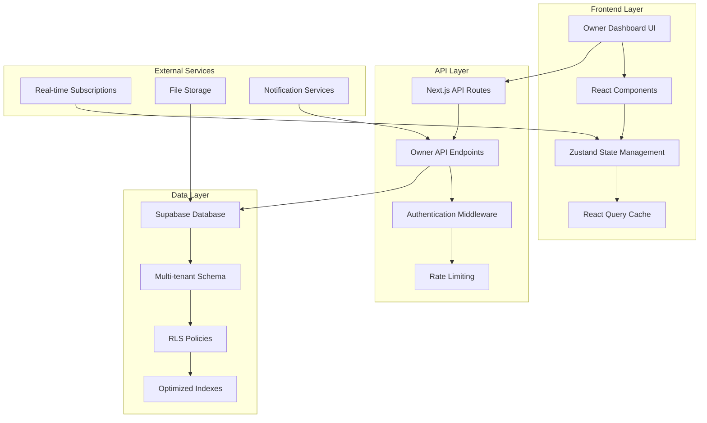
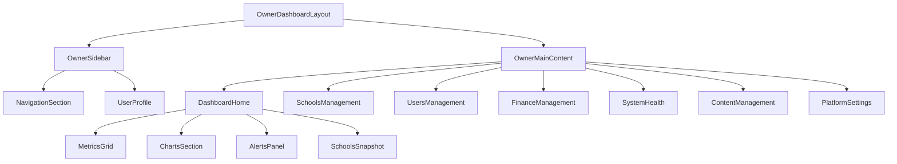
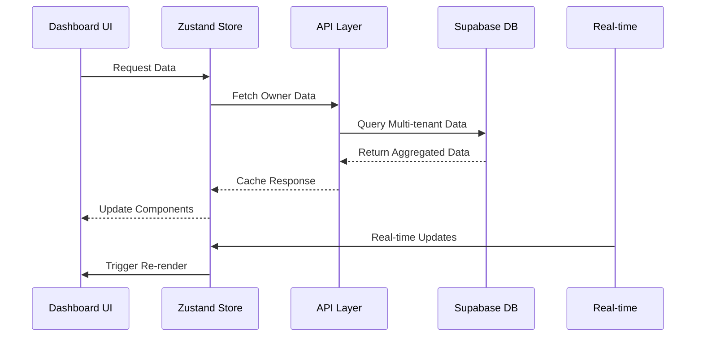

# Owner Dashboard Technical Design Document

## Overview

The Owner Dashboard is a comprehensive administrative interface for the PwezaCore school management SaaS platform. This system provides the platform owner (super admin) with complete visibility and control across all schools, users, finances, and system health metrics. The dashboard serves as the central command center for managing the entire multi-tenant platform.

### Key Objectives

- **Platform-wide Oversight**: Monitor and manage all schools, users, and system resources across the entire platform
- **Real-time Monitoring**: Provide instant visibility into system health, performance metrics, and critical alerts
- **Financial Management**: Track revenue, subscriptions, and financial performance across all schools
- **Security & Compliance**: Ensure robust access control, audit logging, and security monitoring
- **Performance Optimization**: Deliver sub-200ms page loads with efficient data handling and caching

### Scope

This design covers the complete owner dashboard implementation including:
- Modern sidebar navigation system with 7 main sections
- Dashboard landing page with 23 key metrics and visualizations
- 13 major functional areas (Schools, Users, Finance, System Health, etc.)
- Real-time updates and performance optimization
- Security and access control implementation
- Integration with existing PwezaCore architecture

## Architecture

### System Architecture Overview

The Owner Dashboard follows a modern React-based architecture integrated with the existing PwezaCore system:



### Component Architecture

The dashboard follows a hierarchical component structure:



### Data Flow Architecture



## Components and Interfaces

### Core Components

#### 1. OwnerDashboardLayout
**Purpose**: Main layout wrapper providing structure and navigation
**Props**:
```typescript
interface OwnerDashboardLayoutProps {
  children: React.ReactNode;
  currentSection?: string;
}
```

#### 2. OwnerSidebar
**Purpose**: Modern sidebar navigation with 7 main sections
**Features**:
- Collapsible design for responsive layouts
- Active section highlighting
- Smooth animations with Framer Motion
- Consistent glass morphism styling

```typescript
interface OwnerSidebarProps {
  isCollapsed: boolean;
  onCollapse: (collapsed: boolean) => void;
  activeSection: string;
}
```

#### 3. DashboardMetricsGrid
**Purpose**: Display key platform metrics in a responsive grid
**Features**:
- Real-time metric updates
- Loading states and error handling
- Responsive grid layout (1-4 columns based on screen size)

```typescript
interface MetricCardProps {
  title: string;
  value: string | number;
  change?: {
    value: number;
    type: 'increase' | 'decrease';
    period: string;
  };
  icon: React.ComponentType;
  loading?: boolean;
}
```

#### 4. ChartsSection
**Purpose**: Data visualization for trends and analytics
**Charts**:
- School growth (12-month bar chart)
- User growth trend (line chart)
- Revenue trend (area chart)
- Storage usage (donut chart)

```typescript
interface ChartProps {
  data: any[];
  type: 'bar' | 'line' | 'area' | 'donut';
  title: string;
  loading?: boolean;
}
```

#### 5. SchoolsSnapshotTable
**Purpose**: Comprehensive table showing all schools with key metrics
**Features**:
- Virtual scrolling for performance
- Sortable columns
- Quick action buttons (View, Suspend, Message)
- Real-time status updates

```typescript
interface SchoolSnapshotRow {
  id: string;
  name: string;
  plan: string;
  studentCount: number;
  lastActive: Date;
  storageUsage: number;
  storageLimit: number;
  subscriptionStatus: 'active' | 'expired' | 'trial';
  actions: SchoolAction[];
}
```

### API Interfaces

#### Owner Data Endpoints

```typescript
// GET /api/owner/dashboard-metrics
interface DashboardMetrics {
  totalSchools: number;
  activeSchools: number;
  totalUsers: number;
  monthlyRevenue: number;
  databaseSize: string;
  totalStorage: number;
  apiCallsToday: number;
  activeSessions: number;
}

// GET /api/owner/schools
interface SchoolsResponse {
  schools: School[];
  pagination: PaginationInfo;
  filters: FilterOptions;
}

// GET /api/owner/system-health
interface SystemHealth {
  database: DatabaseMetrics;
  storage: StorageMetrics;
  api: ApiMetrics;
  errors: ErrorLog[];
}
```

#### Real-time Subscriptions

```typescript
interface RealtimeSubscription {
  channel: string;
  event: 'dashboard_update' | 'school_change' | 'system_alert';
  payload: any;
}
```

## Data Models

### Owner Dashboard Store

```typescript
interface OwnerDashboardState {
  // Dashboard Data
  metrics: DashboardMetrics | null;
  charts: ChartData | null;
  alerts: Alert[];
  
  // Schools Data
  schools: School[];
  schoolsLoading: boolean;
  schoolsFilters: SchoolFilters;
  
  // Users Data
  users: User[];
  usersLoading: boolean;
  usersFilters: UserFilters;
  
  // System Health
  systemHealth: SystemHealth | null;
  
  // UI State
  sidebarCollapsed: boolean;
  activeSection: string;
  
  // Actions
  fetchDashboardData: () => Promise<void>;
  fetchSchools: (filters?: SchoolFilters) => Promise<void>;
  fetchUsers: (filters?: UserFilters) => Promise<void>;
  updateSchoolStatus: (schoolId: string, status: string) => Promise<void>;
  setSidebarCollapsed: (collapsed: boolean) => void;
  setActiveSection: (section: string) => void;
}
```

### Database Schema Extensions

The owner dashboard leverages existing tables with additional views and functions:

```sql
-- Owner-specific views for aggregated data
CREATE VIEW owner_dashboard_metrics AS
SELECT 
  COUNT(DISTINCT s.school_id) as total_schools,
  COUNT(DISTINCT CASE WHEN s.last_activity > NOW() - INTERVAL '30 days' THEN s.school_id END) as active_schools,
  COUNT(DISTINCT u.user_id) as total_users,
  SUM(CASE WHEN sp.status = 'active' THEN sp.monthly_amount ELSE 0 END) as monthly_revenue
FROM schools s
LEFT JOIN users u ON u.school_id = s.school_id
LEFT JOIN school_subscriptions sp ON sp.school_id = s.school_id;

-- Function for real-time metrics updates
CREATE OR REPLACE FUNCTION notify_owner_dashboard_update()
RETURNS TRIGGER AS $$
BEGIN
  PERFORM pg_notify('owner_dashboard_update', json_build_object(
    'table', TG_TABLE_NAME,
    'operation', TG_OP,
    'timestamp', NOW()
  )::text);
  RETURN NULL;
END;
$$ LANGUAGE plpgsql;
```

## Correctness Properties

*A property is a characteristic or behavior that should hold true across all valid executions of a system-essentially, a formal statement about what the system should do. Properties serve as the bridge between human-readable specifications and machine-verifiable correctness guarantees.*

### Property 1: Metrics Aggregation Accuracy

*For any* set of schools and users in the database, the dashboard metrics SHALL accurately reflect the aggregated totals without discrepancies.

**Validates: Requirements 1.2, 1.3, 1.4, 1.5, 1.7**

### Property 2: Time-based Filtering Consistency

*For any* time-based filter (30-day activity, 24-hour errors, daily API calls), the system SHALL consistently apply the same time boundaries across all related queries and displays.

**Validates: Requirements 1.3, 1.8, 1.13, 1.14, 1.15**

### Property 3: Chart Data Integrity

*For any* chart displaying time-series data (school growth, user growth, revenue trends), the underlying data points SHALL match the source database records when aggregated by the same time periods.

**Validates: Requirements 1.10, 1.11, 1.12**

### Property 4: Alert Threshold Accuracy

*For any* configurable threshold (storage warnings, churn risk, subscription expiration), the system SHALL correctly identify and display all entities that meet or exceed the threshold criteria.

**Validates: Requirements 1.13, 1.14, 1.16**

### Property 5: Navigation State Consistency

*For any* navigation action within the sidebar, the active section highlighting SHALL accurately reflect the current page location and remain consistent across page refreshes.

**Validates: Requirements 2.8**

### Property 6: Responsive Layout Behavior

*For any* screen size below the mobile breakpoint, the sidebar navigation SHALL collapse into a mobile-friendly format while maintaining all functionality.

**Validates: Requirements 2.9**

### Property 7: Owner-only Access Control

*For any* user attempting to access dashboard functionality, the system SHALL grant access if and only if the user has the 'owner' role, denying all other roles regardless of other permissions.

**Validates: Requirements 11.1**

### Property 8: Audit Trail Completeness

*For any* owner action that modifies system state, the action SHALL be recorded in the audit trail with complete metadata including timestamp, user ID, action type, and affected resources.

**Validates: Requirements 11.3**

### Property 9: Input Sanitization Universality

*For any* user input field in the dashboard, the system SHALL apply consistent sanitization rules to prevent XSS attacks, regardless of the input source or destination.

**Validates: Requirements 11.5**

### Property 10: Rate Limiting Enforcement

*For any* API endpoint accessed by the dashboard, the system SHALL enforce rate limits consistently and return appropriate error responses when limits are exceeded.

**Validates: Requirements 11.6**

### Property 11: Sensitive Data Masking

*For any* display of sensitive information (passwords, API keys, tokens), the system SHALL apply masking consistently across all UI components and data exports.

**Validates: Requirements 11.7**

### Property 12: Error Handling Security

*For any* error condition that occurs during dashboard operations, the system SHALL return user-friendly error messages without exposing sensitive system information or stack traces.

**Validates: Requirements 11.10**

## Error Handling

### Error Categories and Strategies

#### 1. Network and API Errors
**Strategy**: Retry with exponential backoff, graceful degradation
```typescript
interface ErrorHandlingConfig {
  maxRetries: 3;
  retryDelay: 1000; // ms
  backoffMultiplier: 2;
  timeout: 30000; // ms
}
```

#### 2. Authentication and Authorization Errors
**Strategy**: Immediate redirect to login, clear session data
```typescript
const handleAuthError = (error: AuthError) => {
  clearAuthTokens();
  redirectToLogin();
  showNotification('Session expired. Please log in again.');
};
```

#### 3. Data Validation Errors
**Strategy**: Show specific field errors, prevent submission
```typescript
interface ValidationError {
  field: string;
  message: string;
  code: string;
}
```

#### 4. System Health Errors
**Strategy**: Show system status banner, disable affected features
```typescript
const handleSystemError = (error: SystemError) => {
  showSystemBanner(error.message);
  disableAffectedFeatures(error.affectedSystems);
};
```

### Error Recovery Mechanisms

1. **Automatic Retry**: For transient network errors
2. **Fallback Data**: Use cached data when real-time updates fail
3. **Progressive Enhancement**: Core functionality works even if advanced features fail
4. **User Feedback**: Clear error messages with actionable next steps

## Testing Strategy

### Dual Testing Approach

The owner dashboard requires both unit tests and property-based tests for comprehensive coverage:

**Unit Tests Focus**:
- Specific UI component behavior
- Error handling scenarios
- Integration points with external services
- Edge cases and boundary conditions

**Property-Based Tests Focus**:
- Data aggregation accuracy across random datasets
- Security and access control with various user roles
- Time-based filtering with random date ranges
- Input sanitization with generated malicious inputs

### Property-Based Testing Configuration

- **Library**: fast-check (JavaScript/TypeScript property-based testing)
- **Iterations**: Minimum 100 per property test
- **Test Tags**: Each property test references its design document property
- **Tag Format**: `Feature: owner-dashboard, Property {number}: {property_text}`

### Testing Implementation

```typescript
// Example property test for metrics aggregation
import fc from 'fast-check';

describe('Owner Dashboard Properties', () => {
  test('Property 1: Metrics Aggregation Accuracy', () => {
    // Feature: owner-dashboard, Property 1: Metrics aggregation accuracy
    fc.assert(fc.property(
      fc.array(schoolGenerator),
      fc.array(userGenerator),
      async (schools, users) => {
        const mockData = setupMockDatabase(schools, users);
        const metrics = await fetchDashboardMetrics();
        
        expect(metrics.totalSchools).toBe(schools.length);
        expect(metrics.totalUsers).toBe(users.length);
        expect(metrics.activeSchools).toBe(
          schools.filter(s => isActiveInLast30Days(s.lastActivity)).length
        );
      }
    ), { numRuns: 100 });
  });
});
```

### Integration Testing

- **Database Integration**: Test with real Supabase instance using test data
- **API Integration**: Test all owner endpoints with various data scenarios
- **Real-time Integration**: Test WebSocket connections and live updates
- **Performance Integration**: Test with large datasets to verify sub-200ms requirements

### Security Testing

- **Access Control**: Verify owner-only access across all endpoints
- **Input Validation**: Test with malicious inputs and edge cases
- **Rate Limiting**: Test API rate limits with burst traffic
- **Audit Logging**: Verify all actions are properly logged

## Performance Optimization

### Caching Strategy

#### 1. Multi-level Caching Architecture
```typescript
interface CacheStrategy {
  // Browser cache for static assets
  browserCache: {
    duration: '1 year';
    assets: ['js', 'css', 'images'];
  };
  
  // React Query cache for API responses
  queryCache: {
    staleTime: 5 * 60 * 1000; // 5 minutes
    cacheTime: 10 * 60 * 1000; // 10 minutes
  };
  
  // Zustand persistence for UI state
  stateCache: {
    persist: ['sidebarCollapsed', 'userPreferences'];
  };
  
  // Server-side cache for expensive queries
  serverCache: {
    redis: true;
    duration: 60; // seconds
  };
}
```

#### 2. Database Query Optimization

**Optimized Indexes**:
```sql
-- Composite indexes for owner dashboard queries
CREATE INDEX idx_schools_activity_status ON schools(last_activity, status);
CREATE INDEX idx_users_school_role ON users(school_id, role, created_at);
CREATE INDEX idx_subscriptions_status_amount ON school_subscriptions(status, monthly_amount);
CREATE INDEX idx_payments_date_school ON student_payments(payment_date, school_id);
```

**Materialized Views for Heavy Aggregations**:
```sql
CREATE MATERIALIZED VIEW owner_dashboard_daily_stats AS
SELECT 
  date_trunc('day', NOW()) as stat_date,
  COUNT(DISTINCT s.school_id) as total_schools,
  COUNT(DISTINCT u.user_id) as total_users,
  SUM(sp.monthly_amount) as total_revenue
FROM schools s
LEFT JOIN users u ON u.school_id = s.school_id
LEFT JOIN school_subscriptions sp ON sp.school_id = s.school_id
WHERE sp.status = 'active';

-- Refresh every hour
SELECT cron.schedule('refresh-owner-stats', '0 * * * *', 'REFRESH MATERIALIZED VIEW owner_dashboard_daily_stats;');
```

### Performance Targets

1. **Page Load Time**: < 200ms for all dashboard pages
2. **Real-time Updates**: < 5 seconds for metric updates
3. **Large Dataset Handling**: Support 10,000+ schools without performance degradation
4. **Memory Usage**: < 100MB for dashboard state management
5. **Bundle Size**: < 500KB for dashboard-specific code

### Lazy Loading Strategy

```typescript
// Route-based code splitting
const SchoolsManagement = lazy(() => import('./components/SchoolsManagement'));
const UsersManagement = lazy(() => import('./components/UsersManagement'));
const FinanceManagement = lazy(() => import('./components/FinanceManagement'));

// Component-level lazy loading for heavy charts
const RevenueChart = lazy(() => import('./components/charts/RevenueChart'));
const SchoolGrowthChart = lazy(() => import('./components/charts/SchoolGrowthChart'));
```

### Virtual Scrolling Implementation

For large data tables (schools, users), implement virtual scrolling:

```typescript
interface VirtualScrollProps {
  items: any[];
  itemHeight: number;
  containerHeight: number;
  renderItem: (item: any, index: number) => React.ReactNode;
}

const VirtualScrollTable: React.FC<VirtualScrollProps> = ({
  items,
  itemHeight,
  containerHeight,
  renderItem
}) => {
  // Implementation using react-window or custom solution
  // Renders only visible items + buffer
};
```

## Security Implementation

### Authentication and Authorization

#### Role-based Access Control
```typescript
interface OwnerAuthGuard {
  checkOwnerRole: (user: User) => boolean;
  validateSession: (token: string) => Promise<boolean>;
  enforceOwnerAccess: (request: Request) => Promise<void>;
}

const ownerAuthMiddleware = async (req: Request, res: Response, next: NextFunction) => {
  const user = await validateAuthToken(req.headers.authorization);
  
  if (!user || user.role !== 'owner') {
    return res.status(403).json({ error: 'Owner access required' });
  }
  
  // Log access attempt
  await logAuditEvent({
    userId: user.id,
    action: 'dashboard_access',
    resource: req.path,
    timestamp: new Date(),
    ipAddress: req.ip
  });
  
  next();
};
```

#### Session Management
```typescript
interface SessionConfig {
  timeout: 8 * 60 * 60 * 1000; // 8 hours
  renewalThreshold: 30 * 60 * 1000; // 30 minutes
  maxConcurrentSessions: 3;
}

const sessionManager = {
  validateSession: async (sessionId: string) => {
    const session = await getSession(sessionId);
    if (!session || session.expiresAt < new Date()) {
      throw new Error('Session expired');
    }
    return session;
  },
  
  renewSession: async (sessionId: string) => {
    await updateSessionExpiry(sessionId, new Date(Date.now() + SessionConfig.timeout));
  }
};
```

### Input Validation and Sanitization

```typescript
import DOMPurify from 'dompurify';
import validator from 'validator';

const sanitizeInput = (input: string, type: 'text' | 'email' | 'url' = 'text') => {
  // Remove potential XSS
  let sanitized = DOMPurify.sanitize(input);
  
  // Type-specific validation
  switch (type) {
    case 'email':
      if (!validator.isEmail(sanitized)) {
        throw new Error('Invalid email format');
      }
      break;
    case 'url':
      if (!validator.isURL(sanitized)) {
        throw new Error('Invalid URL format');
      }
      break;
  }
  
  return sanitized;
};
```

### Rate Limiting

```typescript
interface RateLimitConfig {
  windowMs: 15 * 60 * 1000; // 15 minutes
  maxRequests: 1000; // per window
  skipSuccessfulRequests: false;
  skipFailedRequests: false;
}

const rateLimiter = rateLimit({
  ...RateLimitConfig,
  keyGenerator: (req) => `owner:${req.user.id}:${req.ip}`,
  handler: (req, res) => {
    res.status(429).json({
      error: 'Too many requests',
      retryAfter: Math.ceil(req.rateLimit.resetTime / 1000)
    });
  }
});
```

### Audit Logging

```typescript
interface AuditEvent {
  userId: string;
  action: string;
  resource: string;
  details?: Record<string, any>;
  timestamp: Date;
  ipAddress: string;
  userAgent: string;
  success: boolean;
}

const auditLogger = {
  log: async (event: AuditEvent) => {
    await supabase.from('audit_logs').insert({
      user_id: event.userId,
      action: event.action,
      resource: event.resource,
      details: event.details,
      timestamp: event.timestamp,
      ip_address: event.ipAddress,
      user_agent: event.userAgent,
      success: event.success
    });
  },
  
  logOwnerAction: async (userId: string, action: string, details: any) => {
    await auditLogger.log({
      userId,
      action: `owner:${action}`,
      resource: 'dashboard',
      details,
      timestamp: new Date(),
      ipAddress: getCurrentIP(),
      userAgent: getCurrentUserAgent(),
      success: true
    });
  }
};
```

## Integration Points

### Existing System Integration

#### 1. Authentication System Integration
```typescript
// Extend existing auth store for owner-specific functionality
interface ExtendedAuthState extends AuthState {
  isOwner: boolean;
  ownerPermissions: string[];
  validateOwnerAccess: () => boolean;
}

const useOwnerAuth = () => {
  const auth = useAuthStore();
  
  return {
    ...auth,
    isOwner: auth.role === 'owner',
    validateOwnerAccess: () => auth.role === 'owner',
    ownerPermissions: auth.role === 'owner' ? ['all'] : []
  };
};
```

#### 2. Database Schema Integration
The owner dashboard leverages existing tables without modifications:
- `users` table for user management
- `schools` table for school data
- `students` table for student counts
- `student_payments` table for financial data
- `teachers` table for staff information

#### 3. Notification System Integration
```typescript
// Extend existing notification system for owner alerts
interface OwnerNotification extends Notification {
  priority: 'low' | 'medium' | 'high' | 'critical';
  category: 'system' | 'security' | 'financial' | 'operational';
  affectedSchools?: string[];
}

const ownerNotificationService = {
  sendSystemAlert: async (message: string, priority: 'high' | 'critical') => {
    await notificationService.send({
      type: 'system_alert',
      recipient: 'owner',
      message,
      priority,
      channels: ['email', 'dashboard']
    });
  }
};
```

#### 4. React Router Integration
```typescript
// Extend existing routing with owner-specific routes
const ownerRoutes = [
  {
    path: '/owner',
    element: <OwnerDashboardLayout />,
    children: [
      { path: '', element: <DashboardHome /> },
      { path: 'schools', element: <SchoolsManagement /> },
      { path: 'users', element: <UsersManagement /> },
      { path: 'finance', element: <FinanceManagement /> },
      { path: 'system', element: <SystemHealth /> },
      { path: 'content', element: <ContentManagement /> },
      { path: 'settings', element: <PlatformSettings /> }
    ]
  }
];
```

### API Endpoint Design

Following existing patterns, new owner endpoints:

```typescript
// /api/owner/dashboard-metrics.ts
export default async function handler(req: Request, res: Response) {
  if (req.method !== 'GET') {
    return res.status(405).json({ error: 'Method not allowed' });
  }
  
  const user = await validateOwnerAuth(req);
  const metrics = await fetchDashboardMetrics();
  
  return res.json(metrics);
}

// /api/owner/schools/[action].ts
export default async function handler(req: Request, res: Response) {
  const { action } = req.query;
  const user = await validateOwnerAuth(req);
  
  switch (action) {
    case 'suspend':
      return handleSchoolSuspension(req, res);
    case 'reactivate':
      return handleSchoolReactivation(req, res);
    default:
      return res.status(400).json({ error: 'Invalid action' });
  }
}
```

### Real-time Integration

```typescript
// Extend existing real-time system for owner dashboard
const ownerRealtimeSubscription = supabase
  .channel('owner-dashboard')
  .on('postgres_changes', {
    event: '*',
    schema: 'public',
    table: 'schools'
  }, (payload) => {
    // Update dashboard metrics
    ownerStore.getState().refreshMetrics();
  })
  .on('postgres_changes', {
    event: '*',
    schema: 'public',
    table: 'users'
  }, (payload) => {
    // Update user counts
    ownerStore.getState().refreshUserMetrics();
  })
  .subscribe();
```

This comprehensive design document provides the technical foundation for implementing the Owner Dashboard with all 13 requirements and 133 acceptance criteria. The design emphasizes performance, security, and seamless integration with the existing PwezaCore system while providing the platform owner with powerful tools for managing the entire multi-tenant platform.