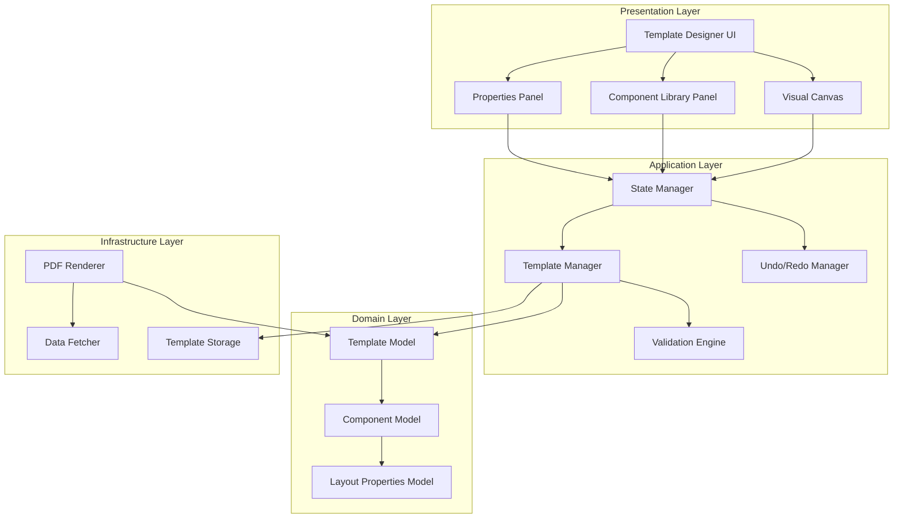

# Design Document: Visual Template Designer

## Overview

The Visual Template Designer is a sophisticated drag-and-drop WYSIWYG template editor that enables school administrators to visually design report templates (report cards, certificates, ID cards, receipts, etc.) while maintaining strict data integrity. The system provides a Canva-like user experience with a coordinate-based canvas, predefined component library, and comprehensive styling controls, while enforcing business rules to prevent unauthorized data manipulation.

### Key Design Principles

1. **Security by Design**: All dynamic components are predefined with fixed data bindings to prevent SQL injection and unauthorized data access
2. **Separation of Concerns**: Clear boundaries between presentation (Canvas), business logic (Template Management), and data access (PDF Renderer)
3. **Immutable State Management**: Template state changes are tracked through an event-sourcing pattern for undo/redo functionality
4. **Type Safety**: Comprehensive TypeScript types and runtime validation using Zod schemas
5. **Performance**: Optimized rendering using React's reconciliation and immediate-mode rendering for large canvases

### Research Summary

Based on research into modern drag-and-drop editors and PDF generation:

- **Drag-and-Drop Architecture**: Libraries like [Craft.js](https://github.com/prevwong/craft.js) and [react-dnd](https://github.com/react-dnd/react-dnd) provide proven patterns for building extensible drag-and-drop editors. Atlassian's [pragmatic-drag-and-drop](https://github.com/atlassian/pragmatic-drag-and-drop) offers a lightweight, framework-agnostic approach.
- **Canvas Rendering**: Immediate-mode rendering (as described in [this article](https://medium.com/better-programming/how-to-create-a-figma-like-infinite-canvas-in-react-a2b0365b2a7)) is essential for performance with large numbers of components, avoiding React's overhead for every canvas element.
- **Undo/Redo Patterns**: Event sourcing and command pattern implementations (see [Konva undo/redo](https://konvajs.org/docs/react/Undo-Redo.html)) provide robust state management for canvas operations.
- **PDF Generation**: [jsPDF](https://github.com/parallax/jsPDF) and [@react-pdf/renderer](https://github.com/diegomura/react-pdf) are mature solutions for client-side PDF generation. React-pdf offers a React-like API for defining PDF layouts.
- **Schema Validation**: [Zod](https://github.com/colinhacks/zod) provides TypeScript-first schema validation with excellent type inference, ideal for validating Template JSON at runtime.

## Architecture

### High-Level Architecture



### Component Architecture

The system follows a layered architecture:

1. **Presentation Layer**: React components for UI rendering and user interaction
2. **Application Layer**: Business logic for template management, validation, and state coordination
3. **Domain Layer**: Core domain models representing templates, components, and layout properties
4. **Infrastructure Layer**: External integrations for PDF generation, storage, and data fetching

### State Management Strategy

The application uses a hybrid state management approach:

- **Local Component State**: For transient UI state (hover, focus, drag preview)
- **Context API**: For sharing canvas state across deeply nested components
- **Event Sourcing**: For undo/redo functionality, maintaining a history of state-changing actions
- **Zustand/Redux**: For global application state (template list, current template, user preferences)

## Components and Interfaces

### Core Components

#### 1. TemplateDesigner (Root Component)

The main container component that orchestrates all sub-components.

```typescript
interface TemplateDesignerProps {
  templateId?: string;
  category?: TemplateCategory;
  onSave?: (template: Template) => void;
  onClose?: () => void;
}

const TemplateDesigner: React.FC<TemplateDesignerProps> = ({
  templateId,
  category,
  onSave,
  onClose
}) => {
  // Component implementation
};
```

#### 2. VisualCanvas

The main editing surface where components are positioned and manipulated.

```typescript
interface VisualCanvasProps {
  template: Template;
  selectedComponentId: string | null;
  zoom: number;
  gridEnabled: boolean;
  gridSpacing: number;
  onComponentSelect: (componentId: string) => void;
  onComponentMove: (componentId: string, position: Position) => void;
  onComponentResize: (componentId: string, size: Size) => void;
  onComponentRotate: (componentId: string, rotation: number) => void;
}

const VisualCanvas: React.FC<VisualCanvasProps> = (props) => {
  // Canvas rendering and interaction logic
};
```

#### 3. ComponentLibrary

The panel displaying available components for the current template category.

```typescript
interface ComponentLibraryProps {
  category: TemplateCategory;
  onComponentDragStart: (componentType: ComponentType) => void;
}

const ComponentLibrary: React.FC<ComponentLibraryProps> = ({
  category,
  onComponentDragStart
}) => {
  const availableComponents = getComponentsForCategory(category);
  // Render component library
};
```

#### 4. PropertiesPanel

The panel for editing selected component properties.

```typescript
interface PropertiesPanelProps {
  component: TemplateComponent | null;
  onPropertyChange: (property: string, value: any) => void;
}

const PropertiesPanel: React.FC<PropertiesPanelProps> = ({
  component,
  onPropertyChange
}) => {
  // Render property editors based on component type
};
```

#### 5. PDFRenderer

The service responsible for converting Template JSON to PDF documents.

```typescript
interface PDFRendererService {
  renderTemplate(template: Template, data: StudentData): Promise<Blob>;
  renderBulk(template: Template, studentIds: string[]): Promise<Blob[]>;
  validateTemplate(template: Template): ValidationResult;
}

class PDFRendererImpl implements PDFRendererService {
  // Implementation using react-pdf or jsPDF
}
```

### State Management Interfaces

#### Template State

```typescript
interface TemplateState {
  current: Template | null;
  history: TemplateSnapshot[];
  historyIndex: number;
  selectedComponentId: string | null;
  clipboard: TemplateComponent | null;
  isDirty: boolean;
}

interface TemplateActions {
  loadTemplate: (templateId: string) => Promise<void>;
  saveTemplate: () => Promise<void>;
  addComponent: (component: TemplateComponent) => void;
  updateComponent: (componentId: string, updates: Partial<TemplateComponent>) => void;
  deleteComponent: (componentId: string) => void;
  undo: () => void;
  redo: () => void;
  selectComponent: (componentId: string | null) => void;
  copyComponent: () => void;
  pasteComponent: () => void;
}
```

#### Undo/Redo Manager

```typescript
interface UndoRedoManager {
  execute: (action: TemplateAction) => void;
  undo: () => void;
  redo: () => void;
  canUndo: () => boolean;
  canRedo: () => boolean;
  clear: () => void;
}

interface TemplateAction {
  type: ActionType;
  execute: (state: TemplateState) => TemplateState;
  undo: (state: TemplateState) => TemplateState;
}

type ActionType = 
  | 'ADD_COMPONENT'
  | 'UPDATE_COMPONENT'
  | 'DELETE_COMPONENT'
  | 'MOVE_COMPONENT'
  | 'RESIZE_COMPONENT'
  | 'ROTATE_COMPONENT'
  | 'GROUP_COMPONENTS'
  | 'UNGROUP_COMPONENTS';
```

## Data Models

### Template Model

```typescript
interface Template {
  id: string;
  name: string;
  category: TemplateCategory;
  pageSize: PageSize;
  pageOrientation: 'portrait' | 'landscape';
  pages: TemplatePage[];
  createdAt: Date;
  updatedAt: Date;
  createdBy: string;
  version: number;
}

type TemplateCategory = 
  | 'REPORT_CARD'
  | 'CERTIFICATE'
  | 'ID_CARD'
  | 'RECEIPT'
  | 'FEE_STATEMENT'
  | 'ADMISSION_FORM'
  | 'RESULT_SLIP';

type PageSize = 'A4' | 'LETTER' | 'LEGAL' | 'CUSTOM';

interface TemplatePage {
  id: string;
  pageNumber: number;
  width: number;
  height: number;
  elements: TemplateComponent[];
}
```

### Component Model

```typescript
interface TemplateComponent {
  id: string;
  type: ComponentType;
  dataBinding?: DataBinding;
  layout: LayoutProperties;
  zIndex: number;
  groupId?: string;
}

type ComponentType =
  // School Info Components
  | 'SCHOOL_LOGO'
  | 'SCHOOL_NAME'
  | 'SCHOOL_MOTTO'
  | 'SCHOOL_ADDRESS'
  | 'SCHOOL_CONTACT'
  // Student Info Components
  | 'STUDENT_NAME'
  | 'STUDENT_PHOTO'
  | 'STUDENT_CLASS'
  | 'STUDENT_STREAM'
  | 'STUDENT_NUMBER'
  | 'STUDENT_ATTENDANCE'
  // Academic Components
  | 'RESULTS_TABLE'
  | 'SUBJECT_SCORES'
  | 'GRADE_DISPLAY'
  | 'AGGREGATE_DISPLAY'
  | 'DIVISION_DISPLAY'
  | 'TEACHER_REMARKS'
  | 'HEAD_TEACHER_COMMENTS'
  // Financial Components
  | 'FEES_BALANCE'
  | 'PAYMENT_SUMMARY'
  | 'FEE_STRUCTURE'
  // Static Components
  | 'LINE'
  | 'BORDER'
  | 'RECTANGLE'
  | 'CIRCLE'
  | 'BACKGROUND_IMAGE'
  | 'WATERMARK'
  | 'TEXT_LABEL'
  | 'SIGNATURE_FIELD';

interface DataBinding {
  field: string;
  formatter?: string;
  fallback?: string;
}
```

### Layout Properties Model

```typescript
interface LayoutProperties {
  position: Position;
  size: Size;
  rotation: number;
  font?: FontProperties;
  color?: ColorProperties;
  border?: BorderProperties;
  spacing?: SpacingProperties;
  alignment?: TextAlignment;
  imagefit?: ImageFit;
}

interface Position {
  x: number; // in pixels or mm
  y: number; // in pixels or mm
  unit: 'px' | 'mm' | 'in';
}

interface Size {
  width: number;
  height: number;
  unit: 'px' | 'mm' | 'in';
  aspectRatioLocked?: boolean;
}

interface FontProperties {
  family: string;
  size: number; // 6-72pt
  weight: 'normal' | 'bold';
  style: 'normal' | 'italic';
}

interface ColorProperties {
  text?: string; // RGB or hex
  background?: string; // RGB or hex
}

interface BorderProperties {
  width: number; // 0-20px
  color: string; // RGB or hex
  style: 'solid' | 'dashed' | 'dotted';
}

interface SpacingProperties {
  padding: number; // 0-50px
  margin: number; // 0-50px
}

type TextAlignment = 'left' | 'center' | 'right' | 'justify';
type ImageFit = 'contain' | 'cover' | 'fill' | 'scale-down';
```

### Results Table Model

```typescript
interface ResultsTableComponent extends TemplateComponent {
  type: 'RESULTS_TABLE';
  tableStyle: ResultsTableStyle;
}

interface ResultsTableStyle {
  borderWidth: number;
  borderColor: string;
  headerBackgroundColor: string;
  headerTextColor: string;
  rowBackgroundColor: string;
  alternatingRowBackgroundColor: string;
  cellPadding: number;
  fontSize: number;
}
```

### Component Group Model

```typescript
interface ComponentGroup {
  id: string;
  name: string;
  componentIds: string[];
  locked: boolean;
}
```

### Template JSON Schema

The Template JSON format for storage and export:

```typescript
interface TemplateJSON {
  template_name: string;
  template_category: TemplateCategory;
  page_size: PageSize;
  page_orientation: 'portrait' | 'landscape';
  pages: PageJSON[];
  version: number;
  created_at: string;
  updated_at: string;
}

interface PageJSON {
  page_number: number;
  width: number;
  height: number;
  elements: ComponentJSON[];
}

interface ComponentJSON {
  component_type: ComponentType;
  data_binding?: {
    field: string;
    formatter?: string;
    fallback?: string;
  };
  layout: {
    position: { x: number; y: number; unit: string };
    size: { width: number; height: number; unit: string };
    rotation: number;
    font?: {
      family: string;
      size: number;
      weight: string;
      style: string;
    };
    color?: {
      text?: string;
      background?: string;
    };
    border?: {
      width: number;
      color: string;
      style: string;
    };
    spacing?: {
      padding: number;
      margin: number;
    };
    alignment?: string;
    imagefit?: string;
  };
  z_index: number;
  group_id?: string;
}
```

### Zod Validation Schemas

```typescript
import { z } from 'zod';

const PositionSchema = z.object({
  x: z.number(),
  y: z.number(),
  unit: z.enum(['px', 'mm', 'in'])
});

const SizeSchema = z.object({
  width: z.number().positive(),
  height: z.number().positive(),
  unit: z.enum(['px', 'mm', 'in']),
  aspectRatioLocked: z.boolean().optional()
});

const FontPropertiesSchema = z.object({
  family: z.string(),
  size: z.number().min(6).max(72),
  weight: z.enum(['normal', 'bold']),
  style: z.enum(['normal', 'italic'])
});

const ColorPropertiesSchema = z.object({
  text: z.string().regex(/^#[0-9A-Fa-f]{6}$|^rgb\(\d{1,3},\s*\d{1,3},\s*\d{1,3}\)$/).optional(),
  background: z.string().regex(/^#[0-9A-Fa-f]{6}$|^rgb\(\d{1,3},\s*\d{1,3},\s*\d{1,3}\)$/).optional()
});

const BorderPropertiesSchema = z.object({
  width: z.number().min(0).max(20),
  color: z.string().regex(/^#[0-9A-Fa-f]{6}$|^rgb\(\d{1,3},\s*\d{1,3},\s*\d{1,3}\)$/),
  style: z.enum(['solid', 'dashed', 'dotted'])
});

const SpacingPropertiesSchema = z.object({
  padding: z.number().min(0).max(50),
  margin: z.number().min(0).max(50)
});

const LayoutPropertiesSchema = z.object({
  position: PositionSchema,
  size: SizeSchema,
  rotation: z.number().min(0).max(360),
  font: FontPropertiesSchema.optional(),
  color: ColorPropertiesSchema.optional(),
  border: BorderPropertiesSchema.optional(),
  spacing: SpacingPropertiesSchema.optional(),
  alignment: z.enum(['left', 'center', 'right', 'justify']).optional(),
  imagefit: z.enum(['contain', 'cover', 'fill', 'scale-down']).optional()
});

const ComponentTypeSchema = z.enum([
  'SCHOOL_LOGO', 'SCHOOL_NAME', 'SCHOOL_MOTTO', 'SCHOOL_ADDRESS', 'SCHOOL_CONTACT',
  'STUDENT_NAME', 'STUDENT_PHOTO', 'STUDENT_CLASS', 'STUDENT_STREAM', 'STUDENT_NUMBER', 'STUDENT_ATTENDANCE',
  'RESULTS_TABLE', 'SUBJECT_SCORES', 'GRADE_DISPLAY', 'AGGREGATE_DISPLAY', 'DIVISION_DISPLAY', 'TEACHER_REMARKS', 'HEAD_TEACHER_COMMENTS',
  'FEES_BALANCE', 'PAYMENT_SUMMARY', 'FEE_STRUCTURE',
  'LINE', 'BORDER', 'RECTANGLE', 'CIRCLE', 'BACKGROUND_IMAGE', 'WATERMARK', 'TEXT_LABEL', 'SIGNATURE_FIELD'
]);

const DataBindingSchema = z.object({
  field: z.string(),
  formatter: z.string().optional(),
  fallback: z.string().optional()
});

const ComponentJSONSchema = z.object({
  component_type: ComponentTypeSchema,
  data_binding: DataBindingSchema.optional(),
  layout: LayoutPropertiesSchema,
  z_index: z.number().int(),
  group_id: z.string().optional()
});

const PageJSONSchema = z.object({
  page_number: z.number().int().positive(),
  width: z.number().positive(),
  height: z.number().positive(),
  elements: z.array(ComponentJSONSchema)
});

const TemplateJSONSchema = z.object({
  template_name: z.string().min(1).max(100),
  template_category: z.enum(['REPORT_CARD', 'CERTIFICATE', 'ID_CARD', 'RECEIPT', 'FEE_STATEMENT', 'ADMISSION_FORM', 'RESULT_SLIP']),
  page_size: z.enum(['A4', 'LETTER', 'LEGAL', 'CUSTOM']),
  page_orientation: z.enum(['portrait', 'landscape']),
  pages: z.array(PageJSONSchema).min(1),
  version: z.number().int().positive(),
  created_at: z.string().datetime(),
  updated_at: z.string().datetime()
});

export type TemplateJSON = z.infer<typeof TemplateJSONSchema>;
```

## Error Handling

### Error Types

```typescript
class TemplateValidationError extends Error {
  constructor(
    message: string,
    public field: string,
    public value: any
  ) {
    super(message);
    this.name = 'TemplateValidationError';
  }
}

class PDFRenderError extends Error {
  constructor(
    message: string,
    public templateId: string,
    public studentId?: string
  ) {
    super(message);
    this.name = 'PDFRenderError';
  }
}

class DataFetchError extends Error {
  constructor(
    message: string,
    public dataType: string,
    public identifier: string
  ) {
    super(message);
    this.name = 'DataFetchError';
  }
}

class AuthorizationError extends Error {
  constructor(
    message: string,
    public userId: string,
    public requiredRole: string
  ) {
    super(message);
    this.name = 'AuthorizationError';
  }
}
```

### Error Handling Strategy

1. **Validation Errors**: Display inline error messages in the properties panel with specific field-level feedback
2. **PDF Render Errors**: Show error toast with option to download error log; continue bulk generation for remaining students
3. **Data Fetch Errors**: Display placeholder text in preview mode; log error for debugging
4. **Authorization Errors**: Redirect to login page or show access denied message
5. **Network Errors**: Implement retry logic with exponential backoff; show offline indicator

### Error Boundaries

```typescript
class TemplateDesignerErrorBoundary extends React.Component<
  { children: React.ReactNode },
  { hasError: boolean; error: Error | null }
> {
  static getDerivedStateFromError(error: Error) {
    return { hasError: true, error };
  }

  componentDidCatch(error: Error, errorInfo: React.ErrorInfo) {
    console.error('Template Designer Error:', error, errorInfo);
    // Log to error tracking service
  }

  render() {
    if (this.state.hasError) {
      return <ErrorFallback error={this.state.error} />;
    }
    return this.props.children;
  }
}
```

## Testing Strategy

### Unit Testing

**Focus Areas:**
- Template validation logic (Zod schema validation)
- Undo/redo manager state transitions
- Component positioning and sizing calculations
- Data binding resolution
- Template JSON parsing and serialization
- Category-specific component filtering
- Layout property range validation

**Testing Approach:**
- Use Jest for test runner
- Use React Testing Library for component testing
- Mock external dependencies (storage, data fetcher)
- Test edge cases: empty templates, maximum component counts, boundary values for layout properties

**Example Unit Tests:**
```typescript
describe('TemplateValidation', () => {
  it('should reject font size below 6pt', () => {
    const component = createComponent({ font: { size: 5 } });
    expect(() => validateComponent(component)).toThrow(TemplateValidationError);
  });

  it('should accept font size at 6pt boundary', () => {
    const component = createComponent({ font: { size: 6 } });
    expect(() => validateComponent(component)).not.toThrow();
  });

  it('should reject components not allowed for category', () => {
    const template = createTemplate({ category: 'ID_CARD' });
    const component = createComponent({ type: 'RESULTS_TABLE' });
    expect(() => addComponentToTemplate(template, component)).toThrow();
  });
});

describe('UndoRedoManager', () => {
  it('should undo component addition', () => {
    const manager = new UndoRedoManager();
    const initialState = createEmptyTemplate();
    const action = new AddComponentAction(createComponent());
    
    manager.execute(action);
    const stateAfterAdd = manager.getCurrentState();
    expect(stateAfterAdd.pages[0].elements).toHaveLength(1);
    
    manager.undo();
    const stateAfterUndo = manager.getCurrentState();
    expect(stateAfterUndo.pages[0].elements).toHaveLength(0);
  });
});
```

### Integration Testing

**Focus Areas:**
- Canvas drag-and-drop interactions
- Component library to canvas workflow
- Properties panel updates reflecting on canvas
- Template save and load workflow
- PDF generation with real data
- Bulk PDF generation
- Template import/export

**Testing Approach:**
- Use Playwright or Cypress for end-to-end testing
- Test complete user workflows
- Verify visual rendering with snapshot testing
- Test keyboard shortcuts
- Test accessibility with axe-core

**Example Integration Tests:**
```typescript
describe('Template Creation Workflow', () => {
  it('should create a report card template with components', async () => {
    await page.goto('/template-designer');
    await page.click('[data-testid="new-template"]');
    await page.selectOption('[data-testid="category-select"]', 'REPORT_CARD');
    
    // Drag component from library to canvas
    await page.dragAndDrop(
      '[data-testid="component-STUDENT_NAME"]',
      '[data-testid="canvas"]'
    );
    
    // Verify component appears on canvas
    await expect(page.locator('[data-testid="canvas-component"]')).toBeVisible();
    
    // Save template
    await page.click('[data-testid="save-template"]');
    await page.fill('[data-testid="template-name"]', 'Test Report Card');
    await page.click('[data-testid="confirm-save"]');
    
    // Verify success message
    await expect(page.locator('[data-testid="success-toast"]')).toBeVisible();
  });
});
```

### Property-Based Testing

Property-based testing is appropriate for this feature because:
- Template JSON parsing/serialization has universal properties (round-trip)
- Component positioning and sizing calculations have invariants
- Validation logic should handle all input variations
- Undo/redo operations have mathematical properties (inverse operations)

**Property-Based Testing Library**: We will use [fast-check](https://github.com/dubzzz/fast-check) for TypeScript/JavaScript property-based testing.

**Configuration**: Each property test will run a minimum of 100 iterations to ensure comprehensive input coverage.

**Property Test Tagging**: Each property-based test will include a comment tag referencing the design document property:
```typescript
// Feature: visual-template-designer, Property 1: Template JSON round-trip preserves structure
```


## Correctness Properties

*A property is a characteristic or behavior that should hold true across all valid executions of a system—essentially, a formal statement about what the system should do. Properties serve as the bridge between human-readable specifications and machine-verifiable correctness guarantees.*

### Property 1: Template JSON Round-Trip Preservation

*For any* valid Template object, serializing to Template JSON then deserializing back to a Template object SHALL produce an equivalent Template with the same structure, components, and properties.

**Validates: Requirements 8.11, 9.5**

### Property 2: Component Position Update Consistency

*For any* component on the canvas and any valid position coordinates, updating the component's position SHALL result in the component being located at exactly those coordinates.

**Validates: Requirements 1.2, 1.4**

### Property 3: Rotation Angle Normalization

*For any* component and any rotation value (including negative values and values greater than 360), the resulting rotation angle SHALL be normalized to a value between 0 and 360 degrees (inclusive of 0, exclusive of 360).

**Validates: Requirements 1.5**

### Property 4: Snap-to-Grid Positioning

*For any* component position and grid spacing configuration, when snap-to-grid is enabled, the component position SHALL be adjusted to the nearest grid intersection point.

**Validates: Requirements 1.6**

### Property 5: Zoom Level Clamping

*For any* zoom input value, the resulting zoom level SHALL be clamped to the range [25, 400] percent.

**Validates: Requirements 1.8**

### Property 6: Undo-Redo Inverse Operations

*For any* template state and any reversible action, executing the action followed by undo SHALL restore the original template state, and executing undo followed by redo SHALL restore the state after the action.

**Validates: Requirements 1.11, 1.12, 1.13**

### Property 7: Z-Index Ordering Preservation

*For any* set of components on the canvas, the visual rendering order SHALL always match the z-index ordering, with higher z-index components rendered above lower z-index components.

**Validates: Requirements 2.1, 2.7**

### Property 8: Z-Index Bring-to-Front Maximum

*For any* component on the canvas, executing "bring to front" SHALL result in that component having a z-index greater than all other components on the same page.

**Validates: Requirements 2.3**

### Property 9: Z-Index Send-to-Back Minimum

*For any* component on the canvas, executing "send to back" SHALL result in that component having a z-index less than all other components on the same page.

**Validates: Requirements 2.4**

### Property 10: Component Creation from Library

*For any* component type in the Component Library, dragging that component to the canvas SHALL create a new component instance of that exact type with default properties.

**Validates: Requirements 3.7**

### Property 11: Custom Component Prevention

*For any* component type not defined in the Component Library, attempting to create a component of that type SHALL be rejected and SHALL NOT add any component to the template.

**Validates: Requirements 3.8**

### Property 12: Category-Based Component Filtering

*For any* template category, the Component Library SHALL display only components that are explicitly allowed for that category, and SHALL hide all components not allowed for that category.

**Validates: Requirements 4.1, 4.2, 4.3, 4.4, 4.5, 4.6, 4.7, 4.8**

### Property 13: Layout Property Range Validation

*For any* layout property with a defined valid range (font size 6-72pt, border width 0-20px, padding 0-50px, margin 0-50px), attempting to set a value outside that range SHALL be rejected, and attempting to set a value within that range SHALL be accepted.

**Validates: Requirements 5.5, 5.6, 5.10, 5.13, 5.14**

### Property 14: Layout Property Application

*For any* component and any valid layout property change, applying the property change SHALL immediately update the component's visual representation on the canvas to reflect the new property value.

**Validates: Requirements 5.16**

### Property 15: Aspect Ratio Lock Preservation

*For any* image component with aspect ratio lock enabled, resizing the component SHALL maintain the original width-to-height ratio regardless of which dimension is adjusted.

**Validates: Requirements 7.3**

### Property 16: Template JSON Structure Validation

*For any* Template JSON string, parsing SHALL succeed if and only if the JSON conforms to the TemplateJSONSchema, and SHALL fail with a descriptive error message for any non-conforming JSON.

**Validates: Requirements 8.12, 14.6**

### Property 17: Template JSON Pretty Printing Consistency

*For any* valid Template object, the pretty-printed Template JSON SHALL use consistent 2-space indentation and SHALL be parseable back into an equivalent Template object.

**Validates: Requirements 9.3, 9.4, 9.5**

### Property 18: Page Addition Preservation

*For any* template with N pages, adding a new page SHALL result in a template with N+1 pages, and all existing pages SHALL remain unchanged in content and order.

**Validates: Requirements 12.1**

### Property 19: Page Removal Preservation

*For any* template with N pages (where N > 1), removing a page SHALL result in a template with N-1 pages, and all remaining pages SHALL maintain their relative order and content.

**Validates: Requirements 12.2**

### Property 20: Component Data Binding Validation

*For any* dynamic component and any data binding value, the binding SHALL be accepted if and only if it appears in the predefined list of valid bindings for that component type.

**Validates: Requirements 14.3, 14.4, 16.1, 16.6**

### Property 21: Category-Component Compatibility Validation

*For any* template with a specific category and any component, adding the component to the template SHALL succeed if and only if the component type is allowed for that template category.

**Validates: Requirements 14.5**

### Property 22: Template Export-Import Round-Trip

*For any* valid template, exporting to a Template JSON file then importing that file SHALL produce a template equivalent to the original template.

**Validates: Requirements 20.4, 20.5, 20.6**

### Property 23: Component Grouping Position Preservation

*For any* set of components with specific relative positions, grouping those components SHALL preserve all relative position relationships between components within the group.

**Validates: Requirements 21.4**

### Property 24: Group Movement Consistency

*For any* component group and any position delta, moving the group SHALL move all components in the group by exactly that delta, maintaining their relative positions.

**Validates: Requirements 21.4**

### Property 25: Alignment Operation Correctness

*For any* set of selected components and any alignment operation (left, center, right, top, middle, bottom), the alignment operation SHALL position all components such that the specified edges or centers are at the same coordinate.

**Validates: Requirements 23.2, 23.3, 23.4, 23.5, 23.6, 23.7**

### Property 26: Distribution Operation Spacing

*For any* set of three or more selected components and any distribution operation (horizontal or vertical), the distribution operation SHALL position components such that the spacing between consecutive components is equal.

**Validates: Requirements 23.8, 23.9**

### Property 27: Input Sanitization Safety

*For any* text input field in the template designer, any input containing HTML tags, JavaScript code, or SQL injection patterns SHALL be sanitized before storage, removing or escaping all potentially dangerous content.

**Validates: Requirements 15.4, 15.5, 15.6**

