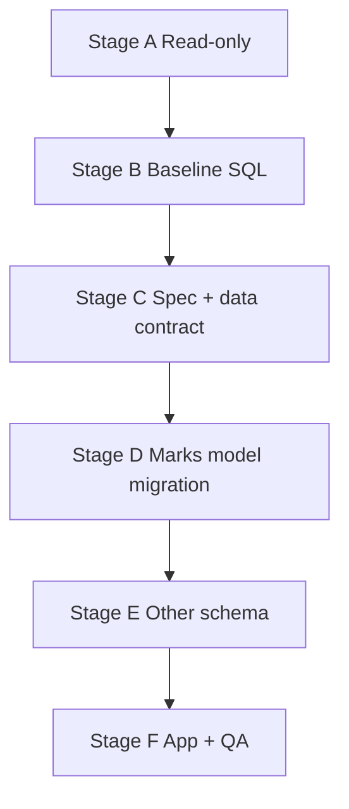

# Secondary reports — master plan (handoff & systematic execution)

**Who this is for:** Anyone opening a **new chat** or picking up the work later. Follow sections **in order**. Do not skip “gates” — each gate exists so the next step does not build on wrong assumptions.

**What this achieves:** All four secondary PDF layouts (**Standard**, **Basic**, **Progressive**, **Alevel**) are filled from the database in a **defined, repeatable** way: correct marks shape (including **Standard multi-topic** and **A-Level multi-paper** per §**1b**), correct supporting fields (comments, attendance, fees, A-Level charts, **per-paper teachers**, etc.), preview and PDF using the **same** data contract.

**Companion documents (read alongside this file):**

| Document | Role |
|----------|------|
| [SECONDARY_REPORT_CARD_TEMPLATES_PLAN.md](./SECONDARY_REPORT_CARD_TEMPLATES_PLAN.md) | Visual/spec: what each card must look like; sample file paths; class-band rules. |
| [SECONDARY_REPORT_DATABASE_AUDIT.md](./SECONDARY_REPORT_DATABASE_AUDIT.md) | What Postgres already has vs gaps; trigger list; design constraints. |
| [UACE_ALEVEL_GRADING_LOGIC.md](./UACE_ALEVEL_GRADING_LOGIC.md) | A-Level grading/points rules for `template4`. |

---

## 1. Glossary (names must stay consistent)

| Your label | Code / slot | Class band | Sample in repo (plan doc) |
|------------|-------------|------------|---------------------------|
| **Standard** | `template1` | O-Level **S.1–S.4** only | `docs/secondary-template-samples/standard-template.pdf` |
| **Basic** | `template2` | O-Level **S.1–S.4** only | `basic-template.png` |
| **Progressive** | `template3` | O-Level **S.1–S.4** only | `progressive-template.png` |
| **Alevel** | `template4` | **S.5–S._6** only | `alevel-template.png` |

**Code pointers:** Template labels in `src/templates/secondary/index.ts`. HTML routing in `src/services/templateHTMLGenerator.ts` (`renderTemplateHTML`). Class detection: `src/components/reports/templates/helpers.ts` (`isOLevelClass`, `isALevelClass`).

---

## 1b. A-Level (Senior 5–6): papers, UNEB codes, school configuration, teachers

This section is **authoritative** for how **`template4` (Alevel)** and **teacher exam entry** must behave. It belongs in the master plan so you do not need to re-explain it in a new chat.

### 1b.1 Subject vs paper (what the card shows)

- One **logical subject** (e.g. **Geography**) may appear on the report as **one row** or **several rows**, depending on how the school configures it.
- When a subject is **dissected** into multiple UNEB papers, each paper is its own row in the **marks table** (e.g. **Geography** with **P250/1** and **Geography** with **P250/2**). The **PAPER** column on the sample card shows the **official paper code** (e.g. `P250/1`, `P250/2`), not a generic “Paper 1” unless the school chooses that label.
- Some subjects stay **single-paper** at a given school; others are **two-paper** (or more). **Both** cases still need a consistent way to store **which paper** a mark row refers to.

### 1b.2 Who decides (not hardcoded globally)

- **`uace_subject_catalog`** (and related seeds) give a **default list of A-Level subject names** (principal vs subsidiary). They do **not** replace **per-school** paper structure.
- **The school** (via **system / admin settings**) is responsible for:
  - Declaring **which subjects** offered in **Senior 5 / Senior 6** are **split into multiple papers** vs **single paper**.
  - Entering and maintaining **paper codes** (UNEB-style identifiers such as **P250/1**, **P250/2**) for each paper row they use.
- The product may ship **reference** or **suggested** paper metadata in the database (optional catalog of typical codes per subject) to speed up setup, but **the school’s configuration** is what exam entry, validation, and **`template4`** must use.

### 1b.3 Teachers (per paper)

- A **single subject** with two papers may have **two different teachers**: e.g. one teacher for **Geography paper 1**, another for **Geography paper 2**.
- The database and UI must support **teacher assignment at paper granularity** (not only at subject granularity) for A-Level classes, so that:
  - Each teacher sees and edits **only** the rows they teach (when the product enforces that).
  - The **TEACHER** column on **`template4`** can show the correct name per **paper row**.

### 1b.4 Implications for later stages (read this when implementing)

| Stage | What to do with these rules |
|-------|-----------------------------|
| **C (data contract)** | For **`template4`**, specify exactly: `PAPER` column ← `paper_code` (or equivalent); subject column ← canonical subject name; overall / subsidiary rows ← how computed; chart series ← which rows roll up by subject. |
| **D (marks model)** | **Uniqueness** for A-Level marks must allow **multiple `exam_results` rows per `(exam_set, student, subject)`** distinguished by **paper identity** (e.g. `paper_code` and/or `paper_number` + school config). Extend **`teacher_upsert_exam_result_secondary`** (and callers) so teachers can pass **paper identity** and it lands on the correct row. |
| **E (schema)** | Add **school-scoped configuration** tables (or guarded columns) for **S5–S6**: which class offers which subject with which papers and codes; optional global **reference** table for suggested UNEB codes only. Add **teacher ↔ (school, class, subject, paper)** assignment storage for A-Level. |
| **F (app)** | Exam grids and report fetch: join marks to **school paper definitions**; group or sort rows for display; respect **teacher-per-paper** when filtering edits. |

**Live DB note:** `exam_results` may already expose `paper_number` (text) — see [SECONDARY_REPORT_DATABASE_AUDIT.md](./SECONDARY_REPORT_DATABASE_AUDIT.md) Stage B **B2**. The **unique constraint** on `(exam_set_id, student_id, subject)` must still be **widened or replaced** in Stage D so two physical rows for the same subject (different papers) are legal.

---

## 2. Mandatory workflow for Supabase SQL

**Rule:** Run **exactly one** query below at a time in the Supabase SQL editor. Paste results into chat (or record them). **Do not** run the next query until the previous one is understood and any failures are resolved.

**Why:** Avoids false conclusions from mixed output and matches how we verified UCE migrations safely.

**Convention:** Use **No limit** in the editor if it injects `LIMIT` inside strings. Each numbered **SQL block** is one step.

---

## 3. Systematic roadmap (first things first)

Work through **Stages A → F** in order. Later stages depend on earlier decisions and data.

```text
Stage A — Read-only: align people + docs (no schema changes)
Stage B — Baseline DB discovery (SQL one-at-a-time)
Stage C — Freeze spec + data contract (documentation + product sign-off)
Stage D — Marks storage model (migration + RPC + triggers) — blocking for Standard + Alevel
Stage E — Remaining schema gaps (fees, student strip fields, projects, charts, optional settings)
Stage F — Application: shaped payload + template HTML + QA
```

---

### Stage A — Read-only alignment (do this first)

**Purpose:** Everyone agrees which document is law for layout and which classes use which template.

1. Read **§1–2** and **§3 per-template** in [SECONDARY_REPORT_CARD_TEMPLATES_PLAN.md](./SECONDARY_REPORT_CARD_TEMPLATES_PLAN.md). Note: **Standard (O-1)** still has many **TBD** fields — finishing those is part of Stage C.
2. Read **Design constraints** and **Have vs gaps** in [SECONDARY_REPORT_DATABASE_AUDIT.md](./SECONDARY_REPORT_DATABASE_AUDIT.md).
3. Confirm in code: O-Level → `template1`–`template3`; A-Level → `template4` (`renderTemplateHTML`).

**Gate A:** Team agrees “we implement to the plan doc + audit; deviations get a written change in the plan doc.”

---

### Stage B — Baseline database discovery (SQL one-at-a-time)

**Purpose:** Record what **your** Supabase project actually has before changing anything. The audit doc is a guide; **live DB is truth**.

Use **Section 8** below — start at **B1** and proceed in order (`B1`, `B2`, …). Stop if a result contradicts the audit (e.g. missing table) and fix or update the audit note.

**Gate B:** Baseline queries completed; gaps list updated if the live DB differs from the written audit.

---

### Stage C — Freeze specification and data contract (before migrations)

**Purpose:** No migration without a written mapping from **DB column or computation** → **each visible cell** on each template.

1. **Standard (`template1`):** Complete TBDs in the plan doc: PDF page structure, **verbatim** table headers, multi-page behaviour, attendance/projects/key blocks.
2. **Basic, Progressive, Alevel:** Replace each **“Data mapping — TBD”** with concrete mappings (field names on a canonical `reportData` / shaped student object).
3. **`template4` (Alevel) — papers:** Follow **§1b** in this file. The signed-off contract must state: source of **`PAPER`** (official code, e.g. `P250/1`); source of **subject name**; how **single-paper** vs **multi-paper** subjects appear; how **overall** / combined rows (if any) are computed; how **TEACHER** per row is resolved (**per-paper** assignment, not assumed same for whole subject).
4. **Alevel charts:** Specify exactly what each series is (e.g. which exam sets, subjects/papers roll-up rules, how “class average” is computed), aligned with [UACE_ALEVEL_GRADING_LOGIC.md](./UACE_ALEVEL_GRADING_LOGIC.md).
5. **School paper configuration (spec):** Describe the **admin UX** and **data model names** for “dissected or not”, paper list per class/subject, and codes — even if implementation is Stage E; Stage C must freeze **behaviour** schools expect.
6. **Documentation sync:** Update [SECONDARY_REPORT_DATABASE_AUDIT.md](./SECONDARY_REPORT_DATABASE_AUDIT.md) with: (a) **read path** per block (`exam_results` vs `processed_secondary_exam_results`), (b) **single** chosen source for **Progressive fees** on the card, (c) chosen approach for **Standard multi-topic** and **A-Level multi-paper** (feeds Stage D), (d) pointer to **§1b** for paper rules.

**Gate C:** Product sign-off on the data contract appendix (can be appended to the bottom of `SECONDARY_REPORT_CARD_TEMPLATES_PLAN.md`).

---

### Stage D — Marks row model (highest technical risk — do after Gate C)

**Problem:** Live Postgres enforces **one row per `(exam_set_id, student_id, subject)`** on `exam_results` (see audit **B1**). That blocks:

- **Standard (O-Level):** multiple rows per subject for **multi-topic** line items.
- **Alevel (S.5–S.6):** multiple rows per subject for **multi-paper** lines (§**1b**), each with its own **official paper code** and optionally **different teacher**.

**Ordered sub-steps:**

1. **Decide** (document in audit): either  
   - **D1-a)** Add dimensions to `exam_results` (e.g. `topic` for O-Level Standard; **`paper_code`** and/or **`paper_number`** for A-Level — aligned with **school configuration** in Stage E) and **replace** the unique constraint so it includes those dimensions **where needed** (partial unique indexes are acceptable if one branch is “no topic / no paper”); or  
   - **D1-b)** Parent row per subject + **child tables** for topics (O-Level) and papers (A-Level).
2. **A-Level alignment:** Whatever option you pick, the physical row for a mark must be uniquely identifiable as **(student, exam_set, subject identity, paper identity)** when the school has configured multiple papers. **Paper identity** must map to the school-configured list from Stage E (**codes** such as `P250/1`, not guessed in app code only).
3. **Migrate** Supabase (new migration file under `supabase/migrations/`).
4. **Update** `teacher_upsert_exam_result_secondary` (and app callers) so teachers can persist **topic** (Standard) and **paper_code / paper_number** (A-Level). Audit **B6** today may omit `p_paper_number` — extend overloads deliberately and document which overload PostgREST clients use.
5. **Processed table policy:** Either extend `processed_secondary_exam_results` with matching keys, aggregate multi-topic/multi-paper into one processed row per subject for comments only, or mandate “detail always from `exam_results`” — write the rule in the audit and implement in `auto_populate_processed_on_exam_insert` accordingly.
6. **Verify** triggers after migration (same SQL discipline: one verification query at a time).

**Gate D:** A student can have **two or more** `exam_results` rows for the same subject on the same exam set when **§1b** or Standard topics require it; RPC writes succeed; processed behaviour matches the written policy.

---

### Stage E — Remaining schema gaps (after Gate D, driven by frozen mapping)

Implement only what Stage C mapped. Typical items from [SECONDARY_REPORT_DATABASE_AUDIT.md](./SECONDARY_REPORT_DATABASE_AUDIT.md):

| Item | When needed |
|------|-------------|
| **A-Level paper configuration (school)** | **Required for §1b:** Tables or structured settings so each **school** defines, for **Senior 5–6** classes: offered subject → **list of papers** (0/1/2+ rows), each with **paper_code** (e.g. `P250/1`), display label, sort order, optional link to a **reference** UNEB catalog row. Schools choose single-paper vs multi-paper per subject. |
| **Teacher ↔ paper assignment (A-Level)** | **Required for §1b:** Store which **teacher** teaches which **(class, subject, paper)** for S5–S6 (distinct from “subject only” if product supports split teaching). Drives exam grid permissions and **`TEACHER`** column on `template4`. |
| Optional **`uace_paper_reference`** (global) | **Optional:** Read-only suggested defaults (subject → typical UNEB codes) to **pre-fill** school setup; **never** override school-configured codes. |
| `teacher_exam_grade_settings` | If product requires stored per-teacher grade bands (**B5** may show different live tables — use audit). |
| `termly_projects` teacher / remark fields | Standard template projects block. |
| `students`: combination, LIN, house (or separate profile table) | Progressive / Alevel strip. |
| Progressive **fees** | One canonical balance: view or RPC; pick `student_fees` vs invoices path in Stage C. |
| Alevel **chart inputs** | Views/RPCs/materialized snapshots aggregating class vs student from `exam_results` (after Stage D; respect paper roll-up rules from Stage C). |
| Zoraki / QR settings | Optional columns on `schools` + rule for username string. |
| Report serial (e.g. S418) | Optional sequence or settings table. |

**UCE learner subjects** (`student_olevel_subjects`, catalog): already used for **O-Level** curriculum rules; **`uace_subject_catalog`** lists **A-Level subject names** but does **not** replace Stage E paper configuration (§**1b**).

**Gate E:** Every cell in the signed-off mapping has a backing column, view, or documented computation; **`template4` PAPER column** resolves from **school configuration**, not hardcoded defaults.

---

### Stage F — Application and QA (last)

**Ordered sub-steps:**

1. **Types:** Define the canonical “secondary shaped student” TypeScript type(s).
2. **Fetch:** One code path (queries/RPCs) building that object: `exam_sets`, `exam_results` (post Stage D), `processed_secondary_exam_results` (dedupe comments), attendance aggregation, fees RPC, A-Level **combination** + **paper-config joins** + **teacher-per-paper** for display, chart series (paper roll-up per Stage C), optional `student_olevel_subjects` filter for O-Level.
3. **Templates:** Wire `generateTemplate1OLevelHTML`, `generateTemplate2KasoziHTML`, `generateTemplate3KyoteraHTML`, `generateTemplate4UpperSectionHTML` in `templateHTMLGenerator.ts` to that object. Preview uses `SecondaryBuiltInHtmlPreview.tsx` → same `renderTemplateHTML` as PDF.
4. **QA:** Golden test school/student per template; A4 preview vs PDF; assert S.1–S.4 never use `template4` for O-Level routing.

**Gate F:** Stakeholder accepts printed output against samples.

---

## 4. Dependency diagram (why order matters)



---

## 5. What “done” means

- Each template cell has a **named** source (column, view, or formula) in the signed-off data contract.
- **Standard** is “done” when its PDF inventory and mappings are no longer TBD.
- **`template4`** is “done” when multi-paper subjects (§**1b**) show correct **official codes**, **per-paper marks**, and **per-paper teachers**, driven by **school configuration** — not a static list in code.
- Preview and PDF use the **same** shaped payload and `renderTemplateHTML` branch for `template1`–`template4`.
- [SECONDARY_REPORT_DATABASE_AUDIT.md](./SECONDARY_REPORT_DATABASE_AUDIT.md) matches the **live** database after migrations.

---

## 6. Optional: Cursor todo IDs (if using task tracking)

These align with the phased work; track in your issue tracker or Cursor todos:

1. `phase0-spec-freeze` — Stage C documentation complete (includes **`template4` paper mapping** and §**1b** behaviour).
2. `phase1-marks-model` — Stage D complete (uniqueness + RPC including **paper identity** for A-Level).
3. `phase2-schema-gaps` — Stage E complete (**school paper configuration** + **teacher-per-paper** + other gaps).
4. `phase3-shaped-payload` — Stage F fetch + types + HTML wiring (join paper config; respect per-paper teachers).
5. `phase4-qa-parity` — Stage F QA complete (include **two-paper subject** + **two-teacher** scenario).

---

## 7. Checklist for a new chat (paste at start)

```text
[ ] I read docs/SECONDARY_REPORT_MASTER_PLAN.md sections 1, 1b, and 3.
[ ] I know the four templates: template1 Standard, template2 Basic, template3 Progressive, template4 Alevel.
[ ] For A-Level (S5–S6), I understand §1b: schools configure papers and codes; multi-paper subjects need multiple mark rows + per-paper teachers.
[ ] I am following Stages A→F in order.
[ ] I run Supabase SQL one query at a time from section 8; I do not batch discovery.
[ ] I do not start Stage D until Gate C (data contract) is signed off.
```

---

## 8. Baseline Supabase SQL playbook (one at a time)

Run **B1** only first. After results are reviewed, run **B2**, and so on.

### B1 — `exam_results` unique constraints and indexes

Shows how duplicate rows are currently prevented (critical for Stage D).

```sql
SELECT c.conname AS constraint_name,
       pg_get_constraintdef(c.oid) AS definition
FROM pg_constraint c
JOIN pg_class t ON t.oid = c.conrelid
JOIN pg_namespace n ON n.oid = t.relnamespace
WHERE n.nspname = 'public'
  AND t.relname = 'exam_results'
  AND c.contype IN ('u', 'p')
ORDER BY c.conname;
```

### B2 — `exam_results` column list (abbreviated)

Confirms ECS / secondary columns exist for O-Level templates.

```sql
SELECT column_name, data_type, is_nullable
FROM information_schema.columns
WHERE table_schema = 'public'
  AND table_name = 'exam_results'
ORDER BY ordinal_position;
```

### B3 — `processed_secondary_exam_results` constraints

```sql
SELECT c.conname AS constraint_name,
       pg_get_constraintdef(c.oid) AS definition
FROM pg_constraint c
JOIN pg_class t ON t.oid = c.conrelid
JOIN pg_namespace n ON n.oid = t.relnamespace
WHERE n.nspname = 'public'
  AND t.relname = 'processed_secondary_exam_results'
  AND c.contype IN ('u', 'p')
ORDER BY c.conname;
```

### B4 — Triggers on `exam_results`

```sql
SELECT tgname AS trigger_name,
       pg_get_triggerdef(oid, true) AS trigger_def
FROM pg_trigger
WHERE tgrelid = 'public.exam_results'::regclass
  AND NOT tgisinternal
ORDER BY tgname;
```

### B5 — Does `teacher_exam_grade_settings` exist?

(Resolves audit “absent” vs migrations present in repo.)

```sql
SELECT table_name
FROM information_schema.tables
WHERE table_schema = 'public'
  AND table_name = 'teacher_exam_grade_settings';
```

### B6 — `teacher_upsert_exam_result_secondary` overloads

```sql
SELECT p.proname,
       pg_get_function_identity_arguments(p.oid) AS args
FROM pg_proc p
JOIN pg_namespace n ON n.oid = p.pronamespace
WHERE n.nspname = 'public'
  AND p.proname = 'teacher_upsert_exam_result_secondary'
ORDER BY args;
```

### B7 — Class template routing: FK to `report_templates`

Confirms settings reference `report_templates.id` (UUID), not the string `template_id` PK.

```sql
SELECT tc.constraint_name,
       kcu.column_name,
       ccu.table_name AS foreign_table,
       ccu.column_name AS foreign_column
FROM information_schema.table_constraints tc
JOIN information_schema.key_column_usage kcu
  ON tc.constraint_name = kcu.constraint_name
  AND tc.table_schema = kcu.table_schema
JOIN information_schema.constraint_column_usage ccu
  ON ccu.constraint_name = tc.constraint_name
  AND ccu.table_schema = tc.table_schema
WHERE tc.table_schema = 'public'
  AND tc.table_name = 'class_template_settings'
  AND tc.constraint_type = 'FOREIGN KEY'
ORDER BY tc.constraint_name, kcu.ordinal_position;
```

**After B1–B7:** Append findings to [SECONDARY_REPORT_DATABASE_AUDIT.md](./SECONDARY_REPORT_DATABASE_AUDIT.md) if they differ from what is written there.

### B9 — `uace_subject_catalog` (A-Level subject names only)

**Purpose:** Confirms the **global** subject list. It does **not** contain per-school paper dissection (§**1b**); Stage E adds school paper configuration separately.

```sql
SELECT subject_type, count(*) AS n
FROM public.uace_subject_catalog
GROUP BY subject_type
ORDER BY subject_type;
```

(Optional follow-up: `SELECT subject_name, subject_type FROM public.uace_subject_catalog ORDER BY sort_order, subject_name LIMIT 20;` — still **one** query per run.)

### B8+ (add as needed after Stage D migrations)

Repeat the **same** B1/B3 pattern after changing uniqueness: confirm new unique indexes and re-run a **small test insert** (in a transaction rolled back) if desired. Add new numbered queries to this section when you define new tables (fees RPC, chart views).

---

*Last updated: §1b A-Level papers; **DB:** migration `supabase/migrations/20260526120000_exam_results_line_keys_uace_papers.sql` implements line-level uniqueness (`topic` + `paper_code`/`paper_number`), `paper_code` column, `teacher_upsert_*` paper params, `school_uace_class_subject_papers`, and `auto_populate_processed_on_exam_insert` for Senior 1–6.*
